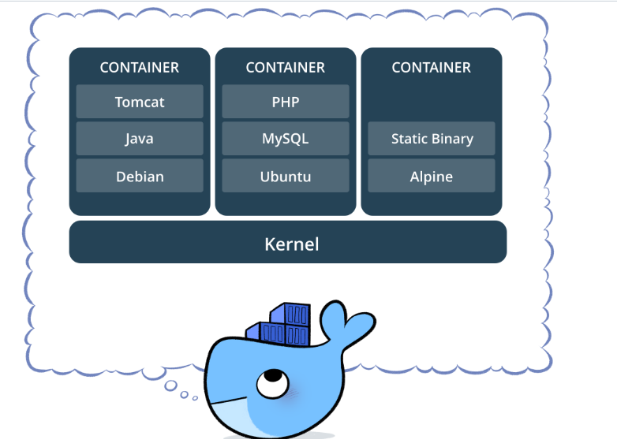
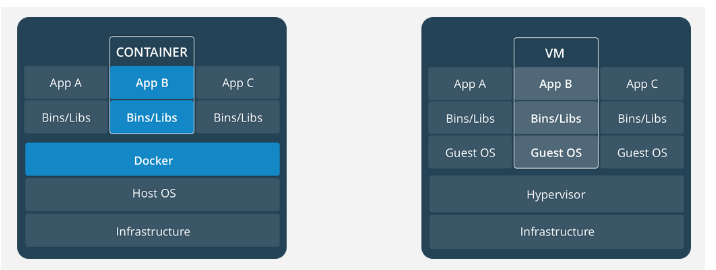
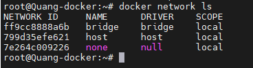
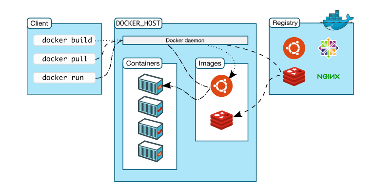

- [1. Lịch sử của docker](#1-lịch-sử-của-docker)
- [2. Giới thiệu về docker](#2-giới-thiệu-về-docker)
  - [2.1 Docker là gì:](#21-docker-là-gì)
  - [2.2 Lợi ích của Docker](#22-lợi-ích-của-docker)
- [3 Các khái niệm cần biết khi sử dụng docker](#3-các-khái-niệm-cần-biết-khi-sử-dụng-docker)
  - [3.1 Image](#31-image)
  - [3.2 Registry](#32-registry)
  - [3.3 Volume](#33-volume)
  - [3.4 Container](#34-container)
  - [3.5 Networking](#35-networking)
  - [3.6 Dockerfile](#36-dockerfile)
  - [3.7 Docker Engine](#37-docker-engine)
- [4. Các thành phần và kiến trúc có trong Docker](#4-các-thành-phần-và-kiến-trúc-có-trong-docker)
- [Tài liệu tham khảo](#tài-liệu-tham-khảo)
# 1. Lịch sử của docker
Docker được thành lập bởi Solomon Hykes vào năm 2013, phát triển từ công ty DotCloud. Vào tháng 3 năm 2013, Docker ra mắt công khai tại PyCon và đến tháng 6 năm 2014, Docker 1.0 được phát hành. Đến năm 2015, DotCloud đổi tên thành Docker Inc., và vào năm 2017, Docker hỗ trợ Kubernetes, đánh dấu sự hợp tác quan trọng trong lĩnh vực điều phối container.
# 2. Giới thiệu về docker
## 2.1 Docker là gì:
- Docker là một công cụ cho phép các nhà phát triển, quản trị viên hệ thống, v.v. dễ dàng triển khai các ứng dụng của họ trong một container để chạy trên hệ điều hành máy chủ tức là Linux
- Virtual machine rất tuyệt vời để cô lập toàn bộ hệ điều hành và tài nguyên phần cứng. Nhưng docker cô lập ứng dụng và hệ thông file của container. 
- Ngoài ra docker còn cô lập process. Container sử dụng các namespace và cgroups của Linux để cô lập các quá trình và tài nguyên hệ thống như CPU, bộ nhớ, và mạng

## 2.2 Lợi ích của Docker
- Khởi động và dừng nhanh: Start và stop container chỉ trong vài giây.
- Di động cao: Khởi chạy container trên mọi hệ thống có Docker.
- Build và loại bỏ nhanh chóng: Dễ dàng thử nghiệm và triển khai ứng dụng.
- Thiết lập môi trường dễ dàng: Cấu hình một lần, chia sẻ cho nhiều người.
- Tối ưu hóa tài nguyên: Sử dụng tài nguyên hệ thống ít hơn máy ảo.
- Tính nhất quán và kiểm soát phiên bản: Đảm bảo môi trường đồng nhất, hỗ trợ rollback.
# 3 Các khái niệm cần biết khi sử dụng docker 
## 3.1 Image
- Image trong Docker hay còn gọi là Mirror. Là một template có sẵn (hoặc có thể tự tạo) với các chỉ dẫn dùng để tạo ra các container.
- Được xây dựng từ một loạt các layers. Mỗi layer là một kết quả đại diện cho một lệnh trong Dockerfile.
- Lưu trữ dưới dạng read-only template.
## 3.2 Registry
- Docker Registry là nơi lưu trữ các image với hai chế độ là private và public
- Là nơi cho phép chia sẻ các image template để sử dụng trong quá trình làm việc với Docker
## 3.3 Volume
- Volume trong Docker là nơi dùng để chia sẻ dữ liệu cho các container
- Có thể thực hiện sử dụng Volume đối với 2 trường hợp:
  - Chia sẻ giữa container với container.
  - Chia sẻ giữa container và host.
## 3.4 Container
- Docker Container là một thể hiện của Docker Image với những thao tác cơ bản để sử dụng qua CLI như start, stop, restart hay delete, ...
- Container Image là một gói phần mềm thực thi lightweight, độc lập và có thể thực thi được bao gồm mọi thứ cần thiết để chạy được nó: code, runtime, system tools, system libraries, settings. Các ứng dụng có sẵn cho cả Linux và Windows, các container sẽ luôn chạy ổn định bất kể môi trường.
  
  

- Containers and virtual machines có sự cách ly và phân bổ tài nguyên tương tự, nhưng có chức năng khác vì các container ảo hóa hệ điều hành thay vì phần cứng
  

  - Nhiều container có thể chạy trên cùng một máy và chia sẻ kernel của hệ điều hành với các container khác, mỗi máy đều chạy như các quá trình bị cô lập trong không gian người dùng. Các container chiếm ít không gian hơn các máy ảo (container image thường có vài trăm thậm chí là vài MB), và start gần như ngay lập tức.
  - Hypervisor cho phép nhiều máy ảo chạy trên một máy duy nhất. Mỗi máy ảo bao gồm một bản sao đầy đủ của một hệ điều hành, một hoặc nhiều ứng dụng, các chương trình và thư viện cần thiết - chiếm hàng chục GB. Máy ảo cũng có thể khởi động chậm.
## 3.5 Networking
- Trong Docker, networking đóng vai trò quan trọng trong việc kết nối các container với nhau và với mạng bên ngoài.
- Docker sử dụng IPtable nhằm định tuyến và kiểm soát lưu lượng mạng giữa các container

- Măc định thì docker hỗ trợ 3 loại network drivers:
  - Bridge Network: Docker sẽ tạo ra một switch ảo. Khi container được tạo ra, interface của container sẽ gắn vào switch ảo này và sử dụng NAT để cho phép container truy cập mạng
  - Host Network: Container sử dụng network namespace của host, chính vì thế IP của container sẽ cùng IP với host
  - None Network:  Không cung cấp bất kỳ kết nối mạng nào cho container. Container hoàn toàn bị cô lập về mạng.
## 3.6 Dockerfile
- Docker Image có thể được tạo ra một cách tự động bằng việc đọc các chỉ dẫn trong Dockerfile
- Dockerfile là một dữ liệu văn bản bao gồm các câu lệnh mà người sử dụng có thể gọi qua các dòng lệnh để tạo ra một image
- Bằng việc sử dụng docker build người dùng có thể tạo một tự động xây dựng thực hiện một số lệnh dòng lệnh liên tiếp.
## 3.7 Docker Engine
- Docker Engine là một ứng dụng client-server. Có hai phiên bản Docker Engine phổ biến là:
  - Docker Community Edition (CE): Là phiên bản miễn phí và chủ yếu dựa vào các sản phầm nguồn mở khác. Cũng sẽ là phiên bản mình sử dụng trong suốt serie này.
  - Docker Enterprise: Khi sử dụng phiên bản này bạn sẽ nhận được sự support của nhà phát hành, có thêm các tính năng quản lý và security.

# 4. Các thành phần và kiến trúc có trong Docker
- Docker Client: là cách mà bạn tương tác với docker thông qua command trong terminal. Docker Client sẽ sử dụng API gửi lệnh tới Docker Daemon.
- Docker server (hay còn gọi là daemon) sẽ chịu trách nhiệm build, run, distrubute Docker container. Docker client và Docker server có thể nằm trên cùng một server hoặc khác server.
- 

- Đầu tiên Docker client (CLI) dùng lệnh sau để chạy một container centos
- Docker daemon sẽ kiểm tra xem nó có image centos nào không. Nếu có nó sẽ chạy container luôn
- Nếu không nó sẽ pull image centos (tag mặc định là lastest) về từ Registry và sau đó mới chạy container.
# Tài liệu tham khảo
https://docker-curriculum.com/

https://docs.docker.com/guides/docker-overview/

https://github.com/hocchudong/ghichep-docker/tree/master/docs

https://viblo.asia/p/docker-la-gi-kien-thuc-co-ban-ve-docker-maGK7qeelj2