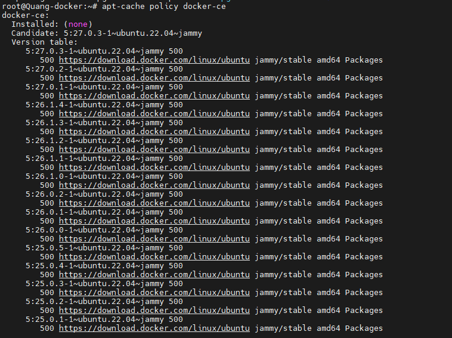
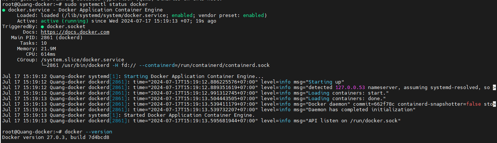

# Cài đặt docker trên Ubuntu 22.04
Mặc định gói cài đặt đã có sẵn trong repo của ubuntu, nhưng đó không phải là bản mới nhất. Dưới đây là cách để bạn tải docker phiên bản mới nhất
- Update 
  ```
  sudo apt update
  ```
- Cài đặt một số gói phụ thuộc
  ```
  sudo apt install apt-transport-https ca-certificates curl software-properties-common
  ```
- thêm khóa GPG cho kho lưu trữ Docker chính thức vào hệ thống của bạn
  ```
  curl -fsSL https://download.docker.com/linux/ubuntu/gpg | sudo gpg --dearmor -o /usr/share/keyrings/docker-archive-keyring.gpg
  ```
- Thêm kho lưu trữ Docker vào nguồn APT
  ```
  echo "deb [arch=$(dpkg --print-architecture) signed-by=/usr/share/keyrings/docker-archive-keyring.gpg] https://download.docker.com/linux/ubuntu $(lsb_release -cs) stable" | sudo tee /etc/apt/sources.list.d/docker.list > /dev/null
  ```
- Update lại 1 lần nữa
  ```
  sudo apt update
  ```
- đảm bảo rằng bạn sắp cài đặt từ kho lưu trữ Docker thay vì kho lưu trữ Ubuntu mặc định
  ```
  apt-cache policy docker-ce
  ```
  
- Cài đặt docker phiên bản mới nhất
  ```
  sudo apt install docker-ce
  ```
- Kiểm tra trạng thái của docker
  ```
  sudo systemctl status docker
  ```
  
- Có thêm 1 tùy chọn để bạn có thể thực hiện lệnh docker mà không cần sudo là bạn cần add user vào group docker
  ```
  sudo usermod -aG docker ${USER}
  ```