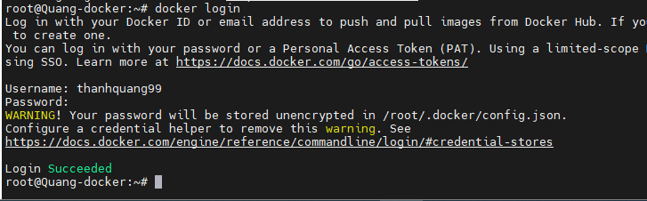

- [Phần 1: Nhóm Lệnh Thao Tác Với Image](#phần-1-nhóm-lệnh-thao-tác-với-image)
  - [`docker images`](#docker-images)
  - [`docker pull`](#docker-pull)
  - [`docker rmi`](#docker-rmi)
  - [`docker tag`](#docker-tag)
  - [`docker push`](#docker-push)
- [Tài liệu tham khảo](#tài-liệu-tham-khảo)
# Phần 1: Nhóm Lệnh Thao Tác Với Image
## `docker images`
  - Chức năng: Hiển thị danh sách các image có sẵn trên máy.

  - Cú pháp:
  ```
  docker images [OPTIONS]
  Options:
  ```
  |Option|	Mặc định|	Mô tả|
  |--|--|--|
  |--digests|	|	Hiển thị digest của image|
  |--filter	|	|Lọc các image theo filter|
  |--no-trunc||		Hiển thị thông tin đầy đủ hơn|
  - Ví dụ:
  ```
  docker images
  ```
## `docker pull`
- Chức năng: Tải một image từ Docker Hub hoặc registry. Yêu cầu cần thiết là bạn phải đăng nhập vào docker hub nếu bạn tải image từ repo private
- Nếu không gắn thêm tag thì mặc định là latest
  - Cú pháp:
  ```
  docker pull [OPTIONS] IMAGE[:TAG|@DIGEST]
  ```
  - Đối với repo private
  ```
  docker pull <user>/<repo>:<tag>
  ```
  - Options:

  |Option|	Mặc định|	Mô tả|
  |--|--|--|
  |--all-tags|		|Tải tất cả các tag của image|
  - Ví dụ:

  ```
  docker pull thanhquang99/beginer:latest
  ```
## `docker rmi`
- Chức năng: Xóa một hoặc nhiều image.

- Cú pháp:
  ```
  docker rmi [OPTIONS] IMAGE [IMAGE...]
  ```
- Options:
  
|Option|	Mặc định	|Mô tả|
|--|--|--|
|--force|		|Xóa ngay cả khi image đang được sử dụng|
|--no-prune|		|Không xóa các image không được sử dụng|
- Ví dụ:
```
docker rmi my_image
```
## `docker tag`
- Chức năng: Gán một tag cho image trên docker hub. Việc bạn muốn đẩy 1 image từ máy lên docker hub yêu cầu cần phải được gắn tag trước

- Cú pháp:

  ```
  docker tag [OPTIONS] IMAGE[:TAG] TARGET_IMAGE[:TAG]
  ```
- Ví dụ:
  ```
  docker tag my-nginx thanhquang99/my_nginx:v1.1
  ```

## `docker push`
- Dùng để đẩy một image mà ta đã build xong vào repo của mình trên docker hub. Lưu ý rằng cần phải đăng nhập và đã gắn tag trước
- Lệnh log in docker hub
  ```
  docker login
  ```
  
- Cú pháp:
  ```
  docker push <user>/<repo>:<tag>
  ```
  ```
  docker push thanhquang99/nginx:v1.1
  ```
# Tài liệu tham khảo
https://github.com/hocchudong/ghichep-docker/blob/master/docs/docker-coban/ghichep-lenh-docker.md