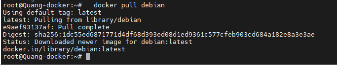

- [Các câu lệnh hay dùng trong docker](#các-câu-lệnh-hay-dùng-trong-docker)
  - [1. Nhóm câu lệnh thao tác với container](#1-nhóm-câu-lệnh-thao-tác-với-container)
- [Tài liệu tham khảo](#tài-liệu-tham-khảo)
# Các câu lệnh hay dùng trong docker
## 1. Nhóm câu lệnh thao tác với container
- Câu lệnh `docker search`:
  - Chức năng: Tìm kiếm một images từ Docker Hub
  - Cú pháp:
  ```
  docker search [OPTIONS] TERM
  ```
  - Ví dụ: 
  ```
  docker search graylog
  ```
- Câu lệnh `docker pull`:
  - Chức năng: Pull một image hoặc một repository từ registry
  - Cú pháp:
  ```
  docker pull [OPTIONS] NAME[:TAG|@DIGEST]
  ```
    |Options|Mặc định|Mô tả|
    |-------|--------|-----|
    |--all-tags , -a||Download tất cả tagged images trong repository|
    |--disable-content-trust|true|Bỏ qua việc xác minh image|
    - NAME là tên của image
  - Ví dụ: Để pull một image từ Docker Hub. Ta thực hiện sử dụng câu lệnh:
  ```
  docker pull debian
  ```
  
- Câu lệnh `docker create`:
  - Chức năng: Tạo ra một container mới
  - Cú pháp:
  ```
  docker create [OPTIONS] IMAGE [COMMAND] [ARG...]
  ```
  |Options|Mô tả|
  |-------|-----|
  |--attach , -a|Attach to STDIN, STDOUT or STDERR|
  |--env , -e|Khai báo giá trị biến môi trường. Một vài image sẽ yêu cầu options này khi tạo ra container|
  |--hostname , -h|Khai báo container host name|
  |--ip|Khai báo địa chỉ IPv4 cho container|
  |--link|Khai báo tên container gắn kết với container sẽ tạo|
  |--name|Khai báo tên cho container|
  |--publish , -p|Publish port(s) của container tới host|
  |--publish-all , -P|Publish tất cả exposed ports to ports ngẫu nhiên|
  |--rm|Tự động xóa container khi thoát ra|
  |--runtime|Khai báo runtime cho container|
  |--volume , -v|	Gán một volume tới container|
  |--tty , -t|cấp một giao diện dòng lệnh tương tác cho các container|
- Câu lệnh `docker cp`:
  - Chức năng: Copy file/ folder giữa container và local filesystem.
  - Cú pháp:
    ```
    docker cp [OPTIONS] CONTAINER:SRC_PATH DEST_PATH|-
    docker cp [OPTIONS] SRC_PATH|- CONTAINER:DEST_PATH
    ```
    |Option|	Mặc định	|Mô tả|
    |-|-|-|
    |--archive , -a|	|	Archive mode (copy all uid/gid information)|
    |--follow-link , -L||		Always follow symbol link in SRC_PATH|

- Câu lệnh docker volume:
  - 
# Tài liệu tham khảo
https://github.com/hocchudong/ghichep-docker/blob/master/docs/docker-coban/ghichep-lenh-docker.md