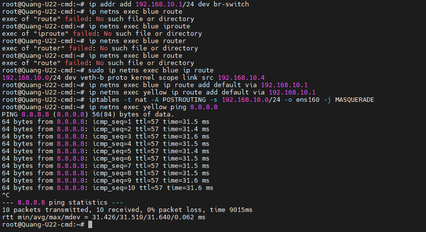

- [Tìm hiểu về network trong docker](#tìm-hiểu-về-network-trong-docker)
  - [1. Tìm hiểu về Network Namespace](#1-tìm-hiểu-về-network-namespace)
    - [1.1 Các thành phần của Network Namespace](#11-các-thành-phần-của-network-namespace)
    - [1.2 Các câu lệnh hay sử dụng](#12-các-câu-lệnh-hay-sử-dụng)
  - [2. Tìm hiểu về Linux bridge](#2-tìm-hiểu-về-linux-bridge)
    - [2.1 Linux bridge có thể làm được những gì](#21-linux-bridge-có-thể-làm-được-những-gì)
    - [2.2 Các câu lệnh thường sử dụng](#22-các-câu-lệnh-thường-sử-dụng)
  - [3. Linux bridge nâng cao](#3-linux-bridge-nâng-cao)
- [Tài liệu tham khảo](#tài-liệu-tham-khảo)
# Tìm hiểu về network trong docker
Network trong docker sử 2 tính năng quan trong để từ đó xây dựng lên network cho chính mình:
- Network namespace
- Linux bridge
## 1. Tìm hiểu về Network Namespace
Để hiểu về network namespace thì ta cần hiểu sơ qua namespace. Namespace là một không gian cô lập, riêng biệt mà linux tạo ra để tránh các nhóm tiến trình bị cô lập với nhau. Ta hãy liên tưởng namespace như là các virtual machine trong VMware vậy

Các VM trong VMware cũng có 1 hệ thống mạng riêng, namespace cũng thế nó cũng cần hệ thống mạng riêng được gọi là network namespace

### 1.1 Các thành phần của Network Namespace

Tương tự như Network của VM thì Network Namespace cũng bao gồm các thành phần:
- Network Interfaces: Tên card mạng của namespace
- IP: Địa chỉ IP của interface của namespace
- Routing Table: Bảng định tuyến của namespace
- Network connection: Dây mạng kết nối giữa các namespace
### 1.2 Các câu lệnh hay sử dụng
Mặc định khi chưa tạo namespace thì ta sẽ có root namespace chứa các namespace ta tạo ra và nó được sinh ra với PID = 1
- Để tạo ra namespace ta sử dụng lệnh
  ```
  ip netns add <name-namespace>
  ```
  ```
  ip netns add blue
  ip netns add yellow
  ```
- Cấu trúc chung khi thao tác với 1 network namespace bất kỳ
  ```
  ip netns exec <name-namespace> <cmd>
  ```
  ```
  ip netns exec blue ip a
  ```
- Tạo 1 pipe kết nối 2 interface lại với nhau
  ```
  ip link add veth-blue type veth peer name veth-yellow
  ```
- Gắn interface vừa tạo vào vào namespace
  ```
  ip link set veth-blue netns blue
  ip link set veth-yellow netns yellow
  ```
- Đặt IP cho các interface của namespace
  ```
  ip -n blue addr add 192.168.10.3 dev veth-blue
  ip -n yellow addr add 192.168.10.4 dev veth-yellow
  ```
- Up interface 
  ```
  ip -n blue link set veth-blue up
  ip -n yellow link set veth-yellow up
  ```

## 2. Tìm hiểu về Linux bridge
### 2.1 Linux bridge có thể làm được những gì


Trong phần tìm hiểu ở trên ta nhận ra rằng việc cấu hình như trên rất tù, không thể giải quyết được vấn đề nếu như nhiều namespace muốn dùng cùng 1 dải mạng kết nối với nhau thì sao?

Chính vì thế ta cần 1 switch ảo để có thể làm được điều đó, docker sử dụng Linux bridge để tạo ra switch ảo. switch này hỗ trợ tối đa 4096 port

Linux Bridge sẽ tạo ra một switch ảo layer 2, những gì mà switch layer 2 có thể làm được thì switch ảo do Linux Bridge tạo ra đều có thể làm được:
- Tính năng switching (chuyển mạch)
- Spanning Tree Protocol
- VLAN
- ...

### 2.2 Các câu lệnh thường sử dụng
- Tạo môt linux bridge
  ```
  ip link add <name-vswitch> type bridge
  ```
  ```
  ip link add br-switch type bridge
  ```
- Up vswitch vừa tạo lên:
  ```
  ip link set dev br-switch up
  ```
- Tiếp theo ta tạo một pairs:
  ```
  ip link add veth-b type veth peer name veth-b-br
  ip link add veth-y type veth peer name veth-y-br
  ```
- Gắn interface vào namespace
  ```
  ip link set veth-b netns blue
  ip link set veth-y netns yellow
  ip link set veth-b-br master br-switch
  ip link set veth-y-br master br-switch
  ```
- Up interface
  ```
  ip netns exec blue ip link set veth-b up
  ip link set veth-b-br up
  ip netns exec yellow ip link set veth-y up
  ip link set veth-y-br up
  ```
- Đặt IP cho interface của namespace
  ```
  ip netns exec yellow ip addr add 192.168.10.3/24 dev veth-y
  ip netns exec blue ip addr add 192.168.10.4/24 dev veth-b
  ```
  
## 3. Linux bridge nâng cao


Ở mục trước ta đã cấu hình các namespace liên lạc được với nhau thông qua swwitch nhưng như vậy mới chỉ là cô lập môi trường các namespace không thể liên lạc ra internet, phần này sẽ hướng dẫn bạn làm cách nào để từ vSwitch có thể thông ra môi trường inter net.

Phần này sẽ lấy kết quả cấu hình ở mục 2.2

- Mặc định linux không cho phép forward ip, ta cần phải bật tính năng này lên
  ```
  echo 1 | sudo tee /proc/sys/net/ipv4/ip_forward
  ```
- Ta cần phải đặt IP cho vSwwitch để nó làm default gateway của các namespace
  ```
  ip addr add 192.168.10.1/24 dev br-switch
  ```
- Tiếp theo ta cần set default route cho các namespace thì mới có hiệu quả
  ```
  ip netns exec blue ip route add default via 192.168.10.1
  ip netns exec yellow ip route add default via 192.168.10.1
  ```
- Ta cần sử dụng IPtables để NAT dải mạng 192.168.10.0/24 đến ens160
  ```
  iptables -t nat -A POSTROUTING -s 192.168.10.0/24 -o ens160 -j MASQUERADE
  ```
  Nếu ta chỉ muốn chỉ định IP 192.168.10.4/24 ra internet thì có thể thay thế bằng lệnh sau:
  ```
  iptables -t nat -A POSTROUTING -s 192.168.10.4/24 -o ens160 -j MASQUERADE
  ```
  
  
- Nâng cao hơn nữa là cấu hình iptable cho phép từ Internet gọi port 8080 của máy chủ Linux để chuyển tiếp đến port 80 của namespace blue thì cần làm như thế nào?
  - Đầu tiên ta cần phải cấu hình IPtable trước đã cấu hình đi đã nhé
  ```
  iptables -t nat -D POSTROUTING -s 192.168.10.4/24 -o ens160 -j MASQUERADE
  ```
  - Tiếp theo ta cần phải thiết lập lại rule mới cho IPtables
  ```
  # Chuyển tiếp port 8080 từ ens160 tới port 80 của namespace blue
  iptables -t nat -A PREROUTING -i ens160 -p tcp --dport 8080 -j DNAT --to-destination 192.168.10.4:80

  # Cho phép các gói tin chuyển tiếp từ ens160 đến bridge br-switch (chiều đi)
  iptables -A FORWARD -i ens160 -o br-switch -p tcp --dport 80 -m state --state NEW,ESTABLISHED,RELATED -j ACCEPT
  # Cho phép các gói tin chuyển tiếp từ bridge br-switch đến ens160 (chiều về)
  iptables -A FORWARD -i br-switch -o ens160 -p tcp --sport 80 -m state --state ESTABLISHED,RELATED -j ACCEPT

  # Cấu hình NAT để cho phép các gói tin từ namespace blue trả lời lại internet
  iptables -t nat -A POSTROUTING -s 192.168.10.0/24 -o ens160 -j MASQUERADE
  ```

Bài toán 2: Tôi muốn từ namespace 2,3,4 là 3 backend chạy đằng sau và từ internet muốn kết nối đến backend 2 port 80 thì phải gọi qua namespace 1 port 8080


# Tài liệu tham khảo
https://www.youtube.com/watch?v=j_UUnlVC2Ss

https://yuminlee2.medium.com/linux-networking-network-namespaces-cb6b00ad6ba4#:~:text=Network%20namespace%20is%20a%20Linux,with%20increased%20security%20and%20flexibility.

https://app.diagrams.net/#G1o5lAtwsj1U2TpvhyS1C0WjOgPKdARwoa#%7B%22pageId%22%3A%22H671K6Hz9qmLiSdwU-q7%22%7D