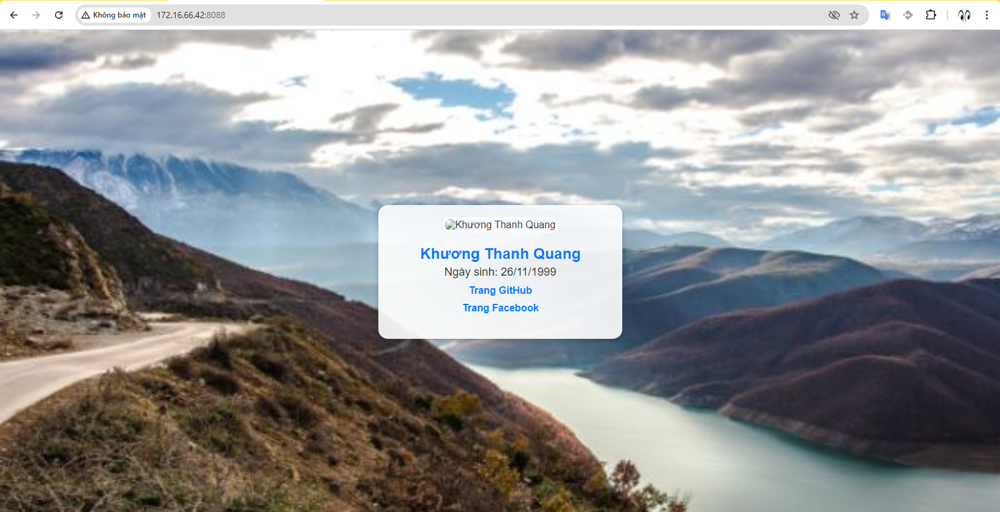

- [1. Lý thuyết về docker file](#1-lý-thuyết-về-docker-file)
- [2. Giải thích các chỉ thị của docker file](#2-giải-thích-các-chỉ-thị-của-docker-file)
	- [2.1 `FROM` :](#21-from-)
	- [2.2 `RUN` :](#22-run-)
	- [2.3 `CMD` :](#23-cmd-)
	- [2.4 `LABEL`:](#24-label)
	- [2.5 EXPOSE :](#25-expose-)
	- [2.6 `ENV`:](#26-env)
	- [2.7 `ADD`](#27-add)
- [3. Ví dụ](#3-ví-dụ)
	- [3.1 Tạo một docker file cấu hình nginx](#31-tạo-một-docker-file-cấu-hình-nginx)
- [Tài liệu tham khảo](#tài-liệu-tham-khảo)
# 1. Lý thuyết về docker file
- Docker file có thể hình dung như một script dùng để build các image trong container
- Docker file bao gồm các câu lệnh liên tiếp nhau được thực hiện tự động trên một image gốc để tạo ra một image mới 
- Trong docker có các câu lệnh chính sau:
  ```
  FROM
  RUN
  CMD
  ...
  ```
# 2. Giải thích các chỉ thị của docker file
Lưu ý các chỉ thị phải được viết bằng chữ in hoa
## 2.1 `FROM` : 
- Bắt đầu một Dockerfile bằng chỉ thị FROM, chỉ ra image gốc mà bạn muốn sử dụng.
- Ví dụ:
  ```
  FROM ubuntu
  hoặc có thể chỉ rõ tag của image gốc:
  FROM ubuntu:14.04
  ```
## 2.2 `RUN` : 
- Thực thi các lệnh trong quá trình xây dựng image.Mỗi lệnh RUN tạo ra một lớp (layer) mới trong image.
- Sử dụng để cài đặt phần mềm, thiết lập cấu hình, và thực hiện các tác vụ cần thiết để chuẩn bị image.
- Ví dụ:
  ```
  FROM ubuntu
  RUN apt-get update
  RUN apt-get install curl -y
  ```
## 2.3 `CMD` : 
- Chỉ định lệnh mặc định sẽ chạy khi container khởi động. Có thể bị ghi đè.
- Mục đích: Đặt lệnh mặc định hoặc tham số mặc định cho container. Nếu lệnh được cung cấp khi khởi chạy container, lệnh đó sẽ ghi đè CMD.
- Ví dụ: 
  ```
  CMD ["nginx", "-g", "daemon off;"]
  ```
## 2.4 `LABEL`: 
- Ghi thêm thông tin về metadate(thông tin bổ xung thêm) vào image
- Metadata này có thể bao gồm thông tin về tác giả, phiên bản, mô tả, và bất kỳ thông tin nào khác mà bạn muốn gắn vào image.
- Ví dụ:
  ```
  LABEL mail_builder="khuongthanhquang276@gmail.com" \
        build_by="thanh quang" \
        build_date="2024-07-30"
  ```
## 2.5 EXPOSE : 
- Khai báo cổng mà ứng dụng bên trong container sẽ lắng nghe. Điều này sẽ giúp firewall biết mở port nào để sử dụng ứng dụng (Không phải NAT)
- Ví dụ khi bạn sử dụng nginx thì cần phải mở port 80 của container thì lệnh này sẽ làm điều đó
- Ví dụ: 
  ```
  EXPOSE 80
  ```
  
## 2.6 `ENV`: 
- Khai báo cáo biến giá trị môi trường. Khi run container từ image, các biến môi trường này vẫn có hiệu lực.
- Biến môi trường giúp bạn quản lý cấu hình của ứng dụng mà không cần phải thay đổi mã nguồn hoặc Dockerfile. 
- Đơn giản hơn ENV giúp bạn chỉ cần khai báo 1 lần mà có thể gọi nhiều lần trên các chỉ dẫn
- Ví dụ: Bạn có một ứng dụng web cần kết nối đến một cơ sở dữ liệu. Thông tin kết nối (như URL, tên người dùng và mật khẩu) thường thay đổi giữa các môi trường phát triển
  ```
  # Thiết lập biến môi trường cho cấu hình
  ENV DB_URL="mysql://localhost:3306/mydb"
  ```
  ```
  docker run -e DB_URL="mysql://db-server:3306/prod_db" my-app
  ```
- 
## 2.7 `ADD`
- Lệnh ADD trong Dockerfile được sử dụng để sao chép các tập tin hoặc thư mục từ máy chủ vào image và có khả năng giải nén các tệp tar tự động
- Chỉ thị ADD copy file, thư mục, remote files URL (src) và thêm chúng vào filesystem của image (dest)
- Ví dụ như khi bạn sử dụng nginx thì sẽ có file index.html chứa logo của cty bạn cho tất cả các container bạn có thể tạo sẵn 1 file trên server rồi add nó vào khi build container
  ```
  ADD has two forms:
  ADD <src>... <dest>
  ADD ["<src>",... "<dest>"] (this form is required for paths containing whitespace)
  ```
# 3. Ví dụ 
## 3.1 Tạo một docker file cấu hình nginx
- Tạo một thư mục chứa docker file và những thư mục bổ trợ
  ```
  mkdir -p /home/docker/docker-file /home/docker/packaging
  ```
- Tiếp theo ta cần tạo 1 file index.html mới giới thiệu về bản thân
  ```
  vi /home/docker/packaging/index.html
  ```
  ```
	<!DOCTYPE html>
	<html lang="en">
	<head>
		<meta charset="UTF-8">
		<meta name="viewport" content="width=device-width, initial-scale=1.0">
		<title>Giới thiệu về Khương Thanh Quang</title>
		<style>
			body {
				font-family: Arial, sans-serif;
				background-image: url('https://www.w3schools.com/w3images/mountains.jpg');
				background-size: cover;
				background-position: center;
				color: #333;
				margin: 0;
				display: flex;
				justify-content: center;
				align-items: center;
				height: 100vh;
				padding: 0 20px; /* Thêm padding bên trái và phải */
			}
			.profile-card {
				background-color: rgba(255, 255, 255, 0.9);
				padding: 20px;
				border-radius: 15px;
				box-shadow: 0 4px 8px rgba(0, 0, 0, 0.2);
				text-align: center;
				max-width: 350px;
				width: 100%;
				margin: 0 auto; /* Canh giữa profile card */
			}
			.profile-image {
				border-radius: 10px;
				width: 150px;
				height: 200px;
				object-fit: cover;
				border: 3px solid #fff;
				margin-bottom: 20px;
			}
			.profile-info h1 {
				margin: 0;
				font-size: 24px;
				color: #007BFF;
			}
			.profile-info p {
				margin: 5px 0;
				font-size: 18px;
				color: #333;
			}
			.links a {
				display: block;
				margin: 10px 0;
				text-decoration: none;
				color: #007BFF;
				font-weight: bold;
				transition: color 0.3s;
			}
			.links a:hover {
				color: #0056b3;
			}
			.additional-info {
				margin-top: 20px;
				font-size: 16px;
				color: #555;
			}
			.additional-info p {
				margin: 5px 0;
			}
		</style>
	</head>
	<body>
		<div class="profile-card">
			
			<div class="profile-info">
				<h1>Khương Thanh Quang</h1>
				<p>Ngày sinh: 26/11/1999</p>
			</div>
			<div class="links">
				<a href="https://github.com/thanhquang99" target="_blank">Trang GitHub</a>
				<a href="https://www.facebook.com/profile.php?id=100012068226476" target="_blank">Trang Facebook</a>
			</div>
			<div class="additional-info">
			</div>
		</div>
	</body>
	</html>
  ```
- Tiếp theo ta tạo docker file
  ```
  vi /home/docker/dockerfile/docker-file
  ```
  ```
  FROM nginx:latest
  RUN rm -rf /usr/share/nginx/html/index.html
  EXPOSE 8000
  COPY packaging/index.html /usr/share/nginx/html/
  CMD ["nginx", "-g", "daemon off;"]
  ```
- Bây giờ ta chỉ cần chạy lệnh và build image
  ```
  docker build -t my-nginx:v1.1 -f /home/docker/dockerfile/docker-file /home/docker/
  ```
  ```
  docker build -t <name-image>:<tag> -f <path docker-file> <path thư mục file phụ trợ>
  ```
- Tiếp theo ta dùng image đó để tạo container
  ```
  docker run -d --name <name-container> -p <port-VM>:<port-container> <name-image>
  ```
  ```
  docker run -d --name my-nginx -p 8088:80 my-nginx:v1.1
  ```
- Kết quả:
  

Bây giờ ta sẽ đẩy image đó lên docker hub
- Đăng nhập vào docker hub
  ```
  docker login
  ```
- Tạo tag cho image trên repo (Lưu ý đã tạo repo rồi)
  ```
  docker tag my-nginx thanhquang99/my_nginx:v1.1
  ```
- Bây giờ tiến hành đẩy image lên
  ```
  docker push thanhquang99/nginx:v1.1
  ```
- Để pull lại image về những máy khác ta cần đăng nhập và sử dụng lệnh
  ```
  docker pull thanhquang99/nginx:v1.1
  ```
# Tài liệu tham khảo
https://github.com/hocchudong/ghichep-docker/blob/master/docs/docker-coban/dockerfile.md