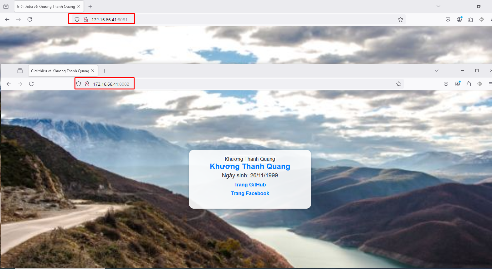

- [1. Docker Volume là gì?](#1-docker-volume-là-gì)
- [2. Phân tích các trường hợp và cách sử dụng](#2-phân-tích-các-trường-hợp-và-cách-sử-dụng)
  - [2.1 Cách sử dụng volumes](#21-cách-sử-dụng-volumes)
  - [2.2 Trường hợp nào thì sử dụng bind mounts](#22-trường-hợp-nào-thì-sử-dụng-bind-mounts)
  - [2.3 Trường hợp nào thì sử dụng tmpfs mount](#23-trường-hợp-nào-thì-sử-dụng-tmpfs-mount)
- [3. Cách sử dụng](#3-cách-sử-dụng)
  - [3.1 Cách sử dụng volumes](#31-cách-sử-dụng-volumes)
  - [3.2 Cách sử dụng bind mounts](#32-cách-sử-dụng-bind-mounts)
  - [3.3 Cách sử dụng tmpfs mounts](#33-cách-sử-dụng-tmpfs-mounts)
- [4. Thư mục con (subdirectory) trong volume (SAI-Chưa hoàn thiện)](#4-thư-mục-con-subdirectory-trong-volume-sai-chưa-hoàn-thiện)
- [5. Volume share](#5-volume-share)
- [Tài liệu tham khảo](#tài-liệu-tham-khảo)
# 1. Docker Volume là gì?
- Docker Volume là một cơ chế để quản lý dữ liệu trong các container Docker. Khi bạn chạy một container, dữ liệu có thể được lưu trữ trong hệ thống file bên trong container đó. Tuy nhiên, khi container bị xóa hoặc tạo lại, dữ liệu này sẽ bị mất. Để giải quyết vấn đề này, Docker cung cấp volumes.
- Docker cung cấp 3 cách khác nhau để có thể chia sẻ dữ liệu (mount data) từ Docker host tới container đó là:
    - volumes
    - bind mounts
    - tmpfs mounts
  


- Hình ảnh trên mô tả vị trí lưu trữ dữ liệu của container trên Docker host. Theo đó, ta có thể thấy được:
  - volumes được lưu trữ như một phần của filesystem trên Docker host và được quản lý bởi Docker (xuất hiện trong /var/lib/docker/volumes trên Linux). Đây được xem là cách tốt nhất để duy trì dữ liệu trong Docker
  - bind mounts cho phép lưu trữ bất cứ đâu trong host system.
  - tmpfs mounts cho phép lưu trữ tạm thời dữ liệu vào bộ nhớ của Docker host, không bao giờ ghi vào filesystem của Docker host.
# 2. Phân tích các trường hợp và cách sử dụng
## 2.1 Cách sử dụng volumes
- volumes được tạo và quản lý bởi Docker. Ta có thể tạo volumes với câu lệnh docker volume create hoặc tạo volumes trong khi tạo containers, ...

- Khi tạo ra volumes, nó sẽ được lưu trữ trong một thư mục trên Docker host (`/var/lib/docker/volumes/<volume-name>`). Khi ta thực hiện mount volumes vào 1 thư mục trong container có nghĩa là khi ta truy cập vào container và thực hiện bất kỳ hành động nào ở thư mục ta vừa mount thì volume cũng sẽ biến đổi theo 

- volumes có thể được mount vào nhiểu containers cùng một lúc. Khi không có containers nào sử dụng volumes thì volumes vẫn ở trạng thái cho phép mount vào containers và không bị xóa một cách tự động.

- Volume là cách phổ biến được lựa chọn để duy trì dữ liệu trong services và containers. Một số trường hợp sử dụng volumes có thể bao gồm:
  - Chia sẻ dữ liệu giữa nhiều containers: Ví dụ container chứa sql cần phải chia sẻ với nhiều container web khác
  - Dữ liệu cần tồn tại khi dừng hoặc xóa containers: Bạn có một cơ sở dữ liệu hoặc một ứng dụng lưu trữ dữ liệu quan trọng cần duy trì, ngay cả khi container chạy ứng dụng bị dừng hoặc bị xóa.
  - Docker host có cấu trúc filesystem không ổn định: như việc nâng cấp hệ điều hành, thay đổi ổ cứng, hoặc các yêu cầu di chuyển hệ thống.
  - Lưu trữ dữ liệu containers trên remote hosts hoặc cloud: Khi bạn muốn chia sẻ cho nhiều docker server khác
  - Khi có nhu cầu sao lưu, backup hoặc migrate dữ liệu tới Docker host khác thì volumes là một sự lựa tốt. Ta cần phải dừng containers sử dụng volumes sau đó thực hiện backup tại đường dẫn `/var/lib/docker/volumes/<volume-name>`
## 2.2 Trường hợp nào thì sử dụng bind mounts
Bind mounts thường được sử dụng trong các trường hợp sau:
- Chia sẻ các file cấu hình từ Docker host tới containers: Bạn có một file cấu hình Nginx trên Docker host ở đường dẫn `/etc/nginx/nginx.conf`. Bạn muốn sử dụng cấu hình này cho container Nginx
- Chia sẻ file hoặc cấu trúc thư mục cố định: container nginx cần ghi log trục tiếp vào file `/var/log/`
## 2.3 Trường hợp nào thì sử dụng tmpfs mount
`tmpfs mounts` được sử dụng trong các trường hợp ta không muốn dữ liệu tồn tại trên Docker host hay containers vì lý do bảo mật hoặc đảm bảo hiệu suất của containers khi ghi một lượng lớn dữ liệu một cách không liên tục.

Nếu bạn có một container cần xử lý thông tin đăng nhập tạm thời mà bạn không muốn lưu lại trên Docker host, bạn có thể sử dụng tmpfs mount

# 3. Cách sử dụng
## 3.1 Cách sử dụng volumes
- Để tạo một volume, ta sử dụng câu lệnh:
  ```
  docker volume create my-vol
  ```
- Khi khởi chạy containers với volume chưa có (tồn tại) thì Docker sẽ tự động tạo ra volume với tên được khai báo hoặc với một tên ngẫu nhiên và đảm bảo tên ngẫu nhiên này là duy nhất. Ví dụ:
  ```
  docker run -d \
    -it \
    --name devtest \
    --mount type=volume,source=myvol2,target=/var/www/html \
    nginx:latest
  ```
  câu lệnh trên sẽ thực hiện tạo volume `myvol2` và mount tới thư mục `/var/www/html` trong container `devtest`.

  Khi này ta sử dụng lệnh đăng nhập vào container và thực hiện bất kỳ thao tác tạo sửa xóa file trên thư mục `/var/www/html` thì trên volume `/var/lib/docker/volumes/myvol2` cũng sẽ thay đổi theo
  ```
  docker exec -it devtest bash
  ```
- Nếu muốn mount volume với chế độ readonly, ta có thể thêm vào trong --mount. Với ví dụ trên có thể là làm như sau:
  ```
  --mount source=myvol2,target=/app,readonly
  ```
## 3.2 Cách sử dụng bind mounts
- Sử dụng tương tự như volume, ta chỉ cần thay đổi giá trị của type trong --mount. Theo đó ta có câu lệnh ví dụ như sau:
  ```
  docker run -d \
    -it \
    --name devtest \
    --mount type=bind,source=/home/thanhquang,target=/var/www/html \
    nginx:latest
  ```
  Lúc này docker sẽ không tạo volume nữa mà sẽ mount thư mục `/home/thanhquang` có sẵn trong máy vào thư mục `/var/www/html` trên container `devtest`. (Lưu ý là thư mục bên trong container nhé) 
## 3.3 Cách sử dụng tmpfs mounts
- Khi sử dụng tmpfs mounts thì ta không thể chia sẻ dữ liệu giữa containers.
- tmpfs mounts chỉ làm việc đối với Linux containers.
- Tương tự như khi sử dụng volumes, ta chỉ cần thay đổi giá trị type trong --mount và bỏ source đi:
  ```
  docker run -d \
    -it \
    --name devtest \
    --mount type=tmpfs,target=/var/www/html \
    nginx:latest
  ```
# 4. Thư mục con (subdirectory) trong volume (SAI-Chưa hoàn thiện)
Mỗi volume thường sẽ có 1 mục đích sử dụng rõ ràng như volume dùng để lưu trữ dữ liệu, volume dùng để lưu log,... Bài toán này sẽ dẫn đến việc do nhiều container cần chia sẻ cùng 1 volume thì sẽ cần phải phân chia ra thư mục nào trong volume dùng để lưu log của container 1 thư mục nào dùng để lưu log của container 2. Chính vì thế sinh ra subdirectory

Ví dụ:
```
# Tạo volume log dùng chung cho cả WordPress và MySQL
docker volume create wordpress_log

# Khởi động container MariaDB và mount subdirectory 'mariadb'
docker run -d \
  --name mariadb_container \
  -e MYSQL_ROOT_PASSWORD=root_password \
  -e MYSQL_DATABASE=wordpress_db \
  --mount source=wordpress_log,target=/var/log,volume-opt=subpath=mariadb \
  mariadb:latest

# Khởi động container WordPress và mount subdirectory 'wordpress'
docker run -d \
  --name wordpress_container \
  -e WORDPRESS_DB_HOST=mariadb_container:3306 \
  -e WORDPRESS_DB_NAME=wordpress_db \
  -e WORDPRESS_DB_USER=root \
  -e WORDPRESS_DB_PASSWORD=root_password \
  --mount source=wordpress_log,target=/var/log,volume-opt=subpath=wordpress \
  -p 8080:80 \
  wordpress:latest
```
# 5. Volume share
Docker volume share là một tính năng cho phép nhiều container sử dụng chung một volume. Ví dụ như bạn có 2 container và 2 container này cùng chạy một image là nginx và bạn muốn 2 container này cùng chạy song song, nếu chẳng may có container này bị down thì sẽ có container kia còn dùng được
- Tạo docker volume
  ```
  docker volume create nginx-data
  ```
- Chạy 2 container nginx dùng chung một volume vừa tạo
  ```
  docker run -d --name nginx-container-1 -v nginx-data:/usr/share/nginx/html -p 8081:80 nginx
  docker run -d --name nginx-container-2 -v nginx-data:/usr/share/nginx/html -p 8082:80 nginx
  ```
- Bây giờ ta sẽ vào container 1 để tạo ra 1 file index xong đó lên trang web truy cập vào 2 container xem có share chung dữ liệu không
  ```
  docker exec -it nginx-container-1 /bin/bash
  ```
  - Ta sẽ dùng lệnh EOF để có thể tạo 1 file index.html nhé
  ```
  cat > /usr/share/nginx/html/index.html << 'EOF'
  <!DOCTYPE html>
  <html lang="en">
  <head>
      <meta charset="UTF-8">
      <meta name="viewport" content="width=device-width, initial-scale=1.0">
      <title>Giới thiệu về Khương Thanh Quang</title>
      <style>
          body {
              font-family: Arial, sans-serif;
              background-image: url('https://www.w3schools.com/w3images/mountains.jpg');
              background-size: cover;
              background-position: center;
              color: #333;
              margin: 0;
              display: flex;
              justify-content: center;
              align-items: center;
              height: 100vh;
              padding: 0 20px; /* Thêm padding bên trái và phải */
          }
          .profile-card {
              background-color: rgba(255, 255, 255, 0.9);
              padding: 20px;
              border-radius: 15px;
              box-shadow: 0 4px 8px rgba(0, 0, 0, 0.2);
              text-align: center;
              max-width: 350px;
              width: 100%;
              margin: 0 auto; /* Canh giữa profile card */
          }
          .profile-image {
              border-radius: 10px;
              width: 150px;
              height: 200px;
              object-fit: cover;
              border: 3px solid #fff;
              margin-bottom: 20px;
          }
          .profile-info h1 {
              margin: 0;
              font-size: 24px;
              color: #007BFF;
          }
          .profile-info p {
              margin: 5px 0;
              font-size: 18px;
              color: #333;
          }
          .links a {
              display: block;
              margin: 10px 0;
              text-decoration: none;
              color: #007BFF;
              font-weight: bold;
              transition: color 0.3s;
          }
          .links a:hover {
              color: #0056b3;
          }
          .additional-info {
              margin-top: 20px;
              font-size: 16px;
              color: #555;
          }
          .additional-info p {
              margin: 5px 0;
          }
      </style>
  </head>
  <body>
      <div class="profile-card">
          
          <div class="profile-info">
              <h1>Khương Thanh Quang</h1>
              <p>Ngày sinh: 26/11/1999</p>
          </div>
          <div class="links">
              <a href="https://github.com/thanhquang99" target="_blank">Trang GitHub</a>
              <a href="https://www.facebook.com/profile.php?id=100012068226476" target="_blank">Trang Facebook</a>
          </div>
          <div class="additional-info">
          </div>
      </div>
  </body>
  </html>
  EOF
  ```
- Bây giờ ta vào trình duyệt và kiểm tra
  
# Tài liệu tham khảo
https://github.com/hocchudong/ghichep-docker/blob/master/docs/docker-coban/docker-volume.md