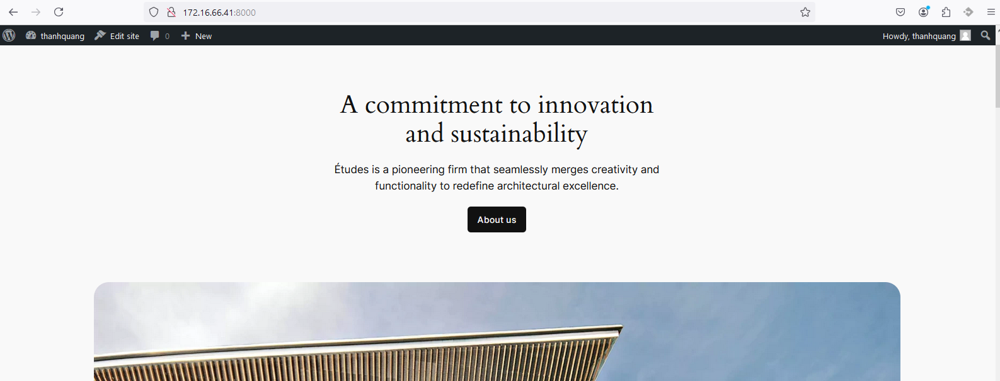

- [1. Docker compose là gì?](#1-docker-compose-là-gì)
- [2. Ví dụ chạy wordpress.](#2-ví-dụ-chạy-wordpress)
- [Tài liệu tham khảo](#tài-liệu-tham-khảo)
# 1. Docker compose là gì?
- Compose là công cụ giúp định nghĩa và khởi chạy multi-container Docker applications.
- Chỉ với một câu lệnh, ta có thể dễ dàng create và start toàn bộ các services phục vụ cho việc chạy ứng dụng.
- Việc sử dụng Docker Compose được tóm lược trong 3 bước cơ bản sau:
    - Khai báo app’s environment với Dockerfile.
    - Khai báo các services cần thiết để chạy app trong docker-compose.yml.
    - Run docker-compose up và Compose sẽ start và run app.
- Ta cần phải phân biệt được là docker file dùng để build image còn docker compose dùng để từ nhiều image build ra nhiều container
# 2. Ví dụ chạy wordpress.
- Chúng ta sẽ tạo ra 2 containers, 1 containers chứa mã nguồn wordpress và 1 containers chưa cơ sở dữ liệu mysql. Bằng cách định nghĩa trong file compose. Chỉ với 1 dòng lệnh khởi tạo, docker sẽ lập tức tạo ra 2 containers và sẵn sàng cho chúng ta dựng lên wordpress, một cách nhanh chóng.
- Ta cần phải kiểm tra version của docker compose
  ```
  root@Quang-docker:~# docker compose version
  Docker Compose version v2.29.1
  ```
- Đoạn mã compose sẽ viết theo cú pháp YAML
    ```
    services:
    db:
        image: mariadb:latest
        volumes:
        - mariadb_data:/var/lib/mysql
        - mariadb_logs:/var/log/mysql
        restart: always
        environment:
        - MYSQL_ROOT_PASSWORD=minhlaquang
        - MYSQL_DATABASE=thanhquang
        - MYSQL_USER=thanhquang
        - MYSQL_PASSWORD=minhlaquang
        ports:
        - "3306:3306"

    wordpress:
        depends_on:
        - db
        image: wordpress:latest
        volumes:
        - wordpress_data:/var/www/html
        - wordpress_logs:/var/log/apache2
        ports:
        - "8000:80"
        restart: always
        environment:
        - WORDPRESS_DB_HOST=db:3306
        - WORDPRESS_DB_USER=thanhquang
        - WORDPRESS_DB_PASSWORD=minhlaquang
        - WORDPRESS_DB_NAME=thanhquang

    volumes:
    mariadb_data:
    mariadb_logs:
    wordpress_data:
    wordpress_logs:
    ```
- Chayj compose
  ```
  docker compose up -d
  ```
- Kiểm tra kết quả:
  
# Tài liệu tham khảo
https://github.com/hocchudong/ghichep-docker/blob/master/docs/docker-coban/docker-compose.md