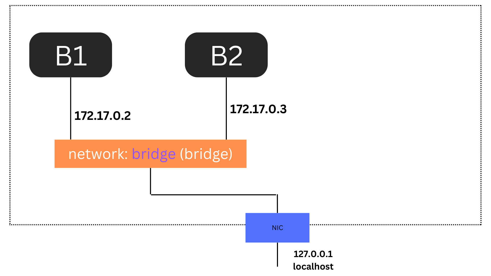
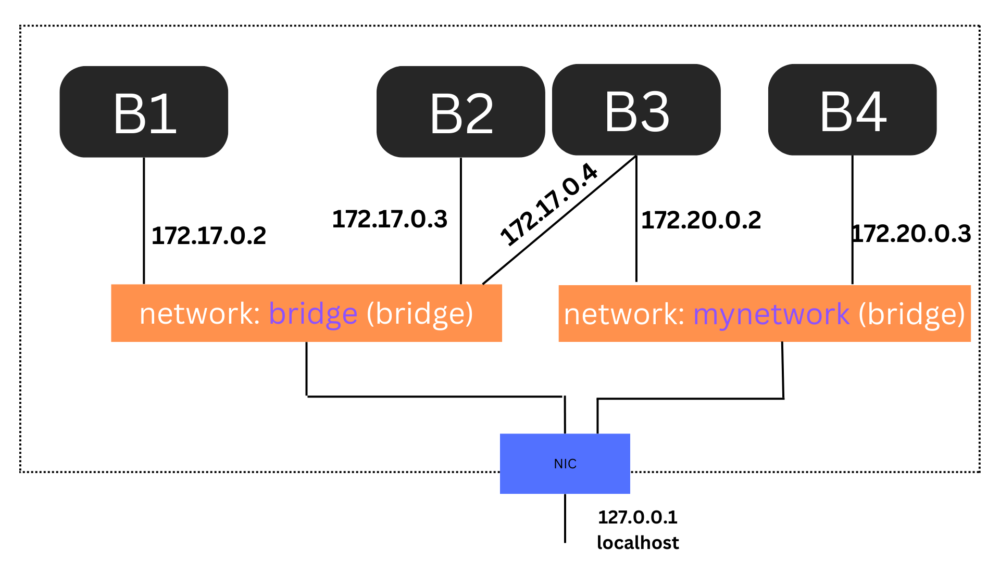

- [Tìm hiểu về docker network](#tìm-hiểu-về-docker-network)
  - [1. Docker network là gì?](#1-docker-network-là-gì)
  - [2. Các loại network cơ bản trong docker](#2-các-loại-network-cơ-bản-trong-docker)
    - [2.1 Network bridge](#21-network-bridge)
    - [2.2 Network host](#22-network-host)
    - [2.3 None network](#23-none-network)
  - [3. User-defined networks](#3-user-defined-networks)
  - [4. DNS Server](#4-dns-server)
  - [5. MacVlan và IPVlan](#5-macvlan-và-ipvlan)
- [Tài liệu tham khảo](#tài-liệu-tham-khảo)
# Tìm hiểu về docker network
## 1. Docker network là gì?
- Khi chúng ta tạo ra các container thì sẽ đặt ra một câu hỏi. Các container sinh ra là để cô lập với môi trường bên ngoài vậy thì làm cách nào để người dùng bên ngoài có thể liên lạc vào trong hay các container liên lạc với nhau bằng cách nào hay có cách nào để giới hạn các container liên lạc được với nhau không?
- Câu trả lời chính là docker network. Docker network sẽ sử dụng cơ chế [namespace network](https://github.com/thanhquang99/Docker/blob/main/namespace-network.md) nhưng sẽ được tối ưu hơn với các câu lệnh docker. Tương tự như network namespace nó sẽ tạo ra các linux bridge và gắn các container vào switch ảo này để các switch ảo có thể liên lạc được với nhau
## 2. Các loại network cơ bản trong docker
Trong docker có 3 loại network cơ bản là:
- bridge : Tạo ra 1 switch ảo và các container sẽ được gắn vào đây
- host : container sẽ chia sẻ network namespace với máy chủ, điều này có nghĩa là container sẽ không có địa chỉ IP riêng và thay vào đó sử dụng địa chỉ IP của host
- none: không gán container vào bất kỳ network nào, container sẽ không có mạng, thường được sử dụng khi không cần hoặc không muốn container có quyền truy cập vào mạng

Mặc định khi tải xuống docker và chưa cấu hình gì sẽ chỉ có 3 loại network này
    ```
    root@Quang-docker:~# docker network ls
    NETWORK ID     NAME      DRIVER    SCOPE
    54926b039095   bridge    bridge    local
    1badb9641815   host      host      local
    c6402fc04fd0   none      null      local
    root@Quang-docker:~# 
    ``` 
- Kể cả khi ta có tạo thêm docker network thì chúng chỉ sử dụng 3 loại driver đã kể trên là bridge, host và null
### 2.1 Network bridge


- Loại network này sẽ sử dụng 1 switch ảo và gắn các interface container lên switch này. Để xem chi thông tin chi tiết ta có thể sử dụng lệnh
    ```
    root@Quang-docker:~# docker inspect bridge
    [
        {
            "Name": "bridge",
            "Id": "54926b039095fecebb1605b1666fa6b1dca6ef4f2e8ecd1dd28590b518fb4d83",
            "Created": "2024-08-16T11:18:12.279321539+07:00",
            "Scope": "local",
            "Driver": "bridge",
            "EnableIPv6": false,
            "IPAM": {
                "Driver": "default",
                "Options": null,
                "Config": [
                    {
                        "Subnet": "172.17.0.0/16",
                        "Gateway": "172.17.0.1"
                    }
                ]
            },
            "Internal": false,
            "Attachable": false,
            "Ingress": false,
            "ConfigFrom": {
                "Network": ""
            },
            "ConfigOnly": false,
            "Containers": {
                "066d7a24c9f4290b0b4426c77e7022eeb15369f079cb92035e9b9179ab00442f": {
                    "Name": "nginx-container-2",
                    "EndpointID": "6533beab138d5486db8b377986a48a085c834ff5ce4b9c0d3cff6b77592bccfe",
                    "MacAddress": "02:42:ac:11:00:03",
                    "IPv4Address": "172.17.0.3/16",
                    "IPv6Address": ""
                },
                "7a108f9979003c96a90b1139866aa62d22ab0724f935aaf9451b50a0c4b77af3": {
                    "Name": "nginx-container-1",
                    "EndpointID": "c36a26834e3e20fc62fccb586e7aa95fd466c321176bd2ba22290db54e7b46bd",
                    "MacAddress": "02:42:ac:11:00:02",
                    "IPv4Address": "172.17.0.2/16",
                    "IPv6Address": ""
                }
            },
            "Options": {
                "com.docker.network.bridge.default_bridge": "true",
                "com.docker.network.bridge.enable_icc": "true",
                "com.docker.network.bridge.enable_ip_masquerade": "true",
                "com.docker.network.bridge.host_binding_ipv4": "0.0.0.0",
                "com.docker.network.bridge.name": "docker0",
                "com.docker.network.driver.mtu": "1500"
            },
            "Labels": {}
        }
    ]
    ```
- Khi bạn tạo bất kỳ một container nào mà không khai báo network thì nó sẽ sử đụng network mặc định này. 
- Các IP được cấp cho container sẽ là dhcp và có thể thay đổi. Chính vì thế docker còn cung cấp cơ chế liên lạc với nhau thông qua docker name
- Ta có thể ping được các container với nhau nhưng khi chạy container trên network mặc định này ta cần khai báo thêm option `--link` vì trên network mặc định này không cung cấp dns
    ```
    # Tạo container 1 tồn tại trong 300s
    root@Quang-docker:~# docker run --rm --name container1 busybox sleep 300
    ```
    ```
    # Tạo container 2 và ping đến container 1 bằng tên
    root@Quang-docker:~# docker run --rm --name container2 --link container1 busybox ping container1
    PING container1 (172.17.0.4): 56 data bytes
    64 bytes from 172.17.0.4: seq=0 ttl=64 time=0.278 ms
    64 bytes from 172.17.0.4: seq=1 ttl=64 time=0.198 ms
    64 bytes from 172.17.0.4: seq=2 ttl=64 time=0.150 ms
    64 bytes from 172.17.0.4: seq=3 ttl=64 time=0.147 ms
    64 bytes from 172.17.0.4: seq=4 ttl=64 time=0.154 ms
    64 bytes from 172.17.0.4: seq=5 ttl=64 time=0.149 ms
    64 bytes from 172.17.0.4: seq=6 ttl=64 time=0.149 ms
    ```
### 2.2 Network host
Containers sẽ dùng mạng trực tiếp của máy host. Network configuration bên trong container đồng nhất với host.
    ```
    root@Quang-docker:~# docker run --rm --network host busybox sleep 300
    PING 172.16.66.41 (172.16.66.41): 56 data bytes
    64 bytes from 172.16.66.41: seq=0 ttl=64 time=0.244 ms
    64 bytes from 172.16.66.41: seq=1 ttl=64 time=0.125 ms
    64 bytes from 172.16.66.41: seq=2 ttl=64 time=0.115 ms
    64 bytes from 172.16.66.41: seq=3 ttl=64 time=0.131 ms
    ```
### 2.3 None network
```
root@Quang-docker:~# docker run --rm --network none busybox sleep 300
root@Quang-docker:~# docker ps
CONTAINER ID   IMAGE     COMMAND                  CREATED          STATUS          PORTS                                   NAMES
5e0789246384   busybox   "sleep 300"              28 seconds ago   Up 27 seconds                                           elated_cannon
aad1921503e3   busybox   "sleep 300"              4 minutes ago    Up 4 minutes                                            gracious_davinci
```
## 3. User-defined networks


- Người dùng có thể tự tạo docker network cho riêng mình. Mặ định thì vẫn sẽ chỉ có 3 loại driver mà đã giới thiệu ở trên
  ```
    root@Quang-docker:~# docker network create --driver bridge --subnet 172.20.0.0/16 mynetwork
    6a8a85e4d7e2c574e486a4ed6981faed340c86453ca0c11f8719ead45d68590a
    root@Quang-docker:~# docker network ls
    NETWORK ID     NAME        DRIVER    SCOPE
    54926b039095   bridge      bridge    local
    1badb9641815   host        host      local
    6a8a85e4d7e2   mynetwork   bridge    local
    c6402fc04fd0   none        null      local
  ```
- Tao 2 container với image busybox trên cùng 1 network mynetwork
  ```
  root@Quang-docker:~# docker run -it --name busybox1 --network mynetwork busybox
  / #
  root@Quang-docker:~# docker run -it --name busybox2 --network mynetwork busybox
  / # ping busybox2
  PING busybox2 (172.20.0.2): 56 data bytes
  64 bytes from 172.20.0.2: seq=0 ttl=64 time=0.707 ms
  64 bytes from 172.20.0.2: seq=1 ttl=64 time=0.132 ms
  64 bytes from 172.20.0.2: seq=2 ttl=64 time=0.132 ms
  ```
- Tạo thêm 1 container với image busybox nhưng trên network bridge mặc định. 
  ```
  root@Quang-docker:~# docker run -it --name busybox3 busybox
  ```
- Thêm container3 vào mynetwork
  ```
  root@Quang-docker:~# docker network connect mynetwork busybox3
  ```
- Ping thử
  ```
  root@Quang-docker:~# docker run -it --name busybox3 busybox
  / # ping busybox1
  ping: bad address 'busybox1'
  / # ping busybox1
  PING busybox1 (172.20.0.3): 56 data bytes
  64 bytes from 172.20.0.3: seq=0 ttl=64 time=0.998 ms
  64 bytes from 172.20.0.3: seq=1 ttl=64 time=0.299 ms
  64 bytes from 172.20.0.3: seq=2 ttl=64 time=0.188 ms
  ```
## 4. DNS Server
- Ta thấy rằng khi sử dụng network bridge thì các container không thể ping được với nhau bằng container name. Điều này sảy ra chính là do chưa có bản ghi dns 
- Khi container được chạy với network default bridge thì container sẽ sao chép nội dung file /etc/resolv.conf của host vào trong container. Do đó, dns-server được cấu hình trên máy host như thế nào, thì trên container tương tự như vậy.
- User-defined networks: Docker sẽ sử dụng built-in dns riêng cho các container cùng 1 network. Ngay khi tạo container thì các bản ghi dns sẽ được tạo ra để có thể phân biệt các container với nhau.
- Chỉ sử dụng dns-server riêng: 
  ```
  docker run -it --name hcm --dns=10.10.10.1 ubuntu /bin/bash
  ```
## 5. MacVlan và IPVlan
- Trên môi trường vật lý VLAN được sử dụng để có thể phân chia ra các mạng riêng biệt. Tương tự như thế trên môi trường ảo hóa docker cũng cung cấp cho ta tính nằng như vậy được gọi là MacVlan và IPVlan. 
- Điểm giồng nhau của chúng là cho phép các container hoạt động như các thiết bị mạng độc lập tương tự như cách các thiết bị mạng vật lý hoạt động. Chúng cũng được sử dụng để phân chia các mạng riêng biệt như Vlan vậy. Mỗi container cũng sẽ có địa chỉ IP ứng với vlan riêng
- Điểm khác nhau cơ bản của 2 mạng này là MacVlan sử dụng địa chỉ Mac để phân biệt còn IPVlan sử dụng địa chỉ IP để phân biệt
- Giả sử bạn có một mạng vật lý với dải IP 192.168.1.0/24 và một máy chủ (host) có địa chỉ IP 192.168.1.10. Bạn muốn các container trên Docker có địa chỉ IP trong cùng dải mạng, để chúng có thể giao tiếp với các thiết bị trên mạng LAN mà không cần thông qua NAT.
  ```
  docker network create -d macvlan \
    --subnet=192.168.1.0/24 \
    --gateway=192.168.1.1 \
    -o macvlan_mode=bridge \
    macvlan_net
  ```
- Giả sử bạn có một mạng vật lý với dải IP 192.168.2.0/24 và muốn sử dụng IPVlan để cấp địa chỉ IP cho các container mà không cần phải sử dụng địa chỉ MAC.
  ```
  docker network create -d ipvlan \
    --subnet=192.168.2.0/24 \
    --gateway=192.168.2.1 \
    -o ipvlan_mode=l2 \
    ipvlan_net
  ```
  - -o ipvlan_mode=l2 chỉ định chế độ layer 2 cho mạng IPVlan
# Tài liệu tham khảo
https://github.com/hocchudong/ghichep-docker/blob/master/docs/docker-coban/docker-network.md