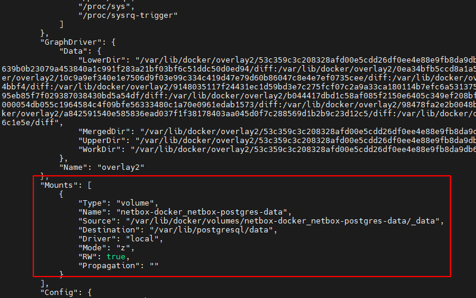
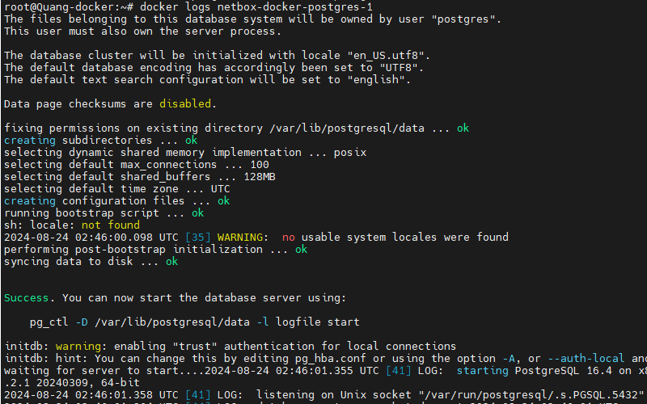

- [Tổng hợp một số cách sử dụng docker hữu ích](#tổng-hợp-một-số-cách-sử-dụng-docker-hữu-ích)
  - [1. Làm cách nào để biết container được mount với những volume nào (Khi quên thông tin)](#1-làm-cách-nào-để-biết-container-được-mount-với-những-volume-nào-khi-quên-thông-tin)
  - [2. Làm cách nào copy 1 file hay thư mục từ host vào container](#2-làm-cách-nào-copy-1-file-hay-thư-mục-từ-host-vào-container)
  - [3. Cách mà container lưu log](#3-cách-mà-container-lưu-log)
- [Tài liệu tham khảo](#tài-liệu-tham-khảo)
# Tổng hợp một số cách sử dụng docker hữu ích
## 1. Làm cách nào để biết container được mount với những volume nào (Khi quên thông tin)
Khi ta quản lý rất nhiều container thì việc quên mất các container được mount đến volume nào là không thể tránh được. Để có thể tìm thấy thông tin của các volume đã mount ta có lệnh sau:
```
docker inspect <container_name_or_id>
```
```
docker inspect netbox-docker-postgres-1
```

## 2. Làm cách nào copy 1 file hay thư mục từ host vào container
Để copy một file hoặc thư mục từ máy host vào container trong Docker, bạn có thể sử dụng lệnh docker cp. Lệnh này cho phép bạn sao chép dữ liệu từ hệ thống file của máy chủ vào một container cụ thể.

```
docker cp <source_path> <container_name_or_id>:<destination_path>
```
Tôi đã tạo ra 1 file test.txt để ở thư mục home và muốn cp vào container `netbox-docker-postgres-1`
```
root@Quang-docker:~# docker cp /home/thanhquang/test.txt netbox-docker-postgres-1:/home/
Successfully copied 2.05kB to netbox-docker-postgres-1:/home/
```
- Tương tự với điều ngược lại ta có thể copy file từ container ra host
  ```
  docker cp <container_name_or_id>:<source_path> <destination_path_on_host>
  ```
  ```
  root@Quang-docker:~# docker cp netbox-docker-postgres-1:/home/test.txt /home/suncloud/
  Successfully copied 2.05kB to /home/suncloud/
  ```
## 3. Cách mà container lưu log 
- Để xem được log do container sinh ra ta có thể dùng lệnh sau:
  ```
  docker logs <container_name_or_id>
  ```
  

- Bạn cũng có thể áp dụng các option tương tự như các câu lệnh cat như xem 10 dòng cuối, xem log theo thời gian thực
  ```
  # Xem 10 dòng cuối
  docker logs --tail 10 <container_name_or_id>
  # Xem log theo thời gian thực
  docker logs -f <container_name_or_id>
  ```
- Để có thể lưu nhật ký của container thông thường ta sẽ mount bind ngay khi triển khai container, thêm vào file compose
  ```
  sudo mkdir -p /var/log/netbox
  sudo chown 1000:1000 /var/log/netbox  # Thay đổi quyền sở hữu nếu cần
  ```
  ```
  - /var/log/netbox:/var/log
  ```

# Tài liệu tham khảo