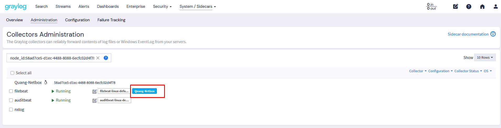

# 1. Hướng dẫn sử dụng Graylog 6.2 với Docker Compose
Cấu hình tối thiểu của graylog:
- CPU: 8 vCPU
- Ram: 8G RAM
- SSD: 30 GB 

## 1.1. Mục đích

Triển khai nhanh hệ thống Graylog 6.2 (MongoDB, DataNode, Graylog Server) bằng Docker Compose, đồng thời hướng dẫn cấu hình output, plugin, rsyslog và sidecar cho log collector.

---

## 1.2. Lưu ý quan trọng trước khi chạy

**Trước khi chạy docker compose, hãy thiết lập kernel parameter:**
```bash
sudo sysctl -w vm.max_map_count=262144
```
Nên thêm vào `/etc/sysctl.conf` để thiết lập vĩnh viễn.

---

## 2. Chuẩn bị & Cài đặt

### 2.1. Clone mã nguồn

```bash
cd /opt/
git clone https://github.com/thanhquang99/Docker
cd Docker/graylog-6.2
```

### 2.2. Tạo mật khẩu và secret

Tạo `password_secret` (chuỗi bí mật để mã hóa dữ liệu):
```bash
openssl rand -hex 32
```
Lấy kết quả làm giá trị cho biến `GRAYLOG_PASSWORD_SECRET`. Thay đổi giá trị biến vào file .env

Tạo `root_password_sha2` (mật khẩu admin, đã hash SHA256):
```bash
echo -n "Enter Password: " && head -1 </dev/stdin | tr -d '\n' | sha256sum | cut -d" " -f1
```
Lấy kết quả làm giá trị cho biến `GRAYLOG_ROOT_PASSWORD_SHA2`. Thay đổi giá trị biến vào file .env


---

### 2.3. Khởi động dịch vụ với biến môi trường động

```bash
docker compose up -d
```
> Các biến truyền như trên sẽ ghi đè giá trị trong file `.env` nếu trùng tên.

---

## 3. Truy cập & Quản trị Graylog

### 3.1. Truy cập Graylog

- Giao diện web: `http://<ip-graylog>:9000`
- Đăng nhập với:
  - Username: `admin`
  - Password: (mật khẩu bạn đã chọn ở bước trên)
- Lưu ý rằng lần đầu tiên đăng nhập ta sẽ không nhập password đã thiết lập ở trên mà password sẽ phải lấy ở log container
```
docker logs graylog-server | head -n 60
```


### 3.2. Quản trị cơ bản

- Xem trạng thái container:
  ```bash
  docker compose ps
  ```
- Xem log:
  ```bash
  docker compose logs -f
  ```
- Dừng dịch vụ:
  ```bash
  docker compose down
  

---

## 4. Lưu ý

- Nếu DataNode báo lỗi về `vm.max_map_count`, hãy chạy:
  ```bash
  sudo sysctl -w vm.max_map_count=262144
  ```
  và thêm vào `/etc/sysctl.conf` để thiết lập vĩnh viễn.
- Nếu cần thay đổi cổng hoặc cấu hình, chỉnh sửa file `docker-compose.yml` tương ứng.
- Không để lộ mật khẩu hoặc secret trong file public.

---

# 5. Hướng dẫn tải xuống plugin dùng cho Graylog

- Trên file docker compose đã tạo 1 volume để quản trị plugin.  
- Di chuyển vào thư mục plugin volume và tải plugin mong muốn, ví dụ:

```bash
cd /var/lib/docker/volumes/graylog-62_graylog_plugin/_data/
wget https://github.com/wizecore/graylog2-output-syslog/releases/download/v6.0.4/graylog-output-syslog-6.0.4.jar
```
Ngoài ra bạn có thể chọn các phiên bản khác tại [link này](https://github.com/wizecore/graylog2-output-syslog/releases).

- Sau đó restart lại container Graylog:
```bash
docker restart graylog-server
```

---

# 6. Hướng dẫn cấu hình Graylog Output

- Vào **Output** → **Launch new output**  
  

- Vào **Stream** → **Data routing** → **Destination** → Chọn output vừa tạo  
  

---

# 7. Hướng dẫn cấu hình rsyslog server nhận log từ Graylog

- Tạo file cấu hình:
```bash
vi /etc/rsyslog.d/graylog-output.conf
```
- Nội dung ví dụ:
```bash
# Load TCP module
module(load="imtcp")

# Lắng nghe TCP port 5140
input(type="imtcp" port="5140")

# Tạo thư mục log nếu chưa có
$ActionFileDefaultTemplate RSYSLOG_TraditionalFileFormat

# Lưu toàn bộ log nhận qua TCP vào file tcp.log
*.* /var/log/graylog-output/tcp.log
```
- Khởi động lại rsyslog:
```bash
systemctl restart rsyslog
systemctl status rsyslog
```
- Kiểm tra kết quả:


---

# 8. Hướng dẫn cấu hình Graylog Sidecar cho Ubuntu 22.04

## 8.1. Cài đặt collector

```bash
curl -fsSL https://artifacts.elastic.co/GPG-KEY-elasticsearch | sudo gpg --dearmor -o /etc/apt/trusted.gpg.d/elastic.gpg
echo "deb [arch=amd64 signed-by=/etc/apt/trusted.gpg.d/elastic.gpg] https://artifacts.elastic.co/packages/8.x/apt stable main" | sudo tee /etc/apt/sources.list.d/elastic-8.x.list
sudo apt update
sudo apt install filebeat -y
```

## 8.2. Cài đặt Sidecar

```bash
wget https://github.com/Graylog2/collector-sidecar/releases/download/1.5.1/graylog-sidecar_1.5.1-1_amd64.deb
sudo dpkg -i graylog-sidecar_1.5.1-1_amd64.deb
```
```bash
systemctl status graylog-sidecar filebeat
systemctl enable graylog-sidecar filebeat
```

## 8.3. Tạo API key cho Sidecar


## 8.4. Chỉnh sửa file cấu hình Sidecar

```bash
vi /etc/graylog/sidecar/sidecar.yml
```
Ví dụ cấu hình:
```yaml
server_url: "http://172.16.66.41:9000/api/"
server_api_token: "1vgn054apmruopr5b2m9uiskaiucg0vqq0d67j5t3inga8mise57"
node_id: "file:/etc/graylog/sidecar/node-id"
node_name: "Quang-Netbox"
update_interval: 10
tls_skip_verify: true
send_status: true
list_log_files:
    - "/var/log/"
cache_path: "/var/cache/graylog-sidecar"
log_path: "/var/log/graylog-sidecar"
log_rotate_max_file_size: "10MiB"
collector_configuration_directory: "/var/lib/graylog-sidecar/generated"
tags:
  - default
collector_binaries_accesslist:
 - "/usr/bin/filebeat"
 - "/usr/bin/packetbeat"
 - "/usr/bin/metricbeat"
 - "/usr/bin/heartbeat"
 - "/usr/bin/auditbeat"
 - "/usr/bin/journalbeat"
 - "/usr/lib/graylog-sidecar/filebeat"
 - "/usr/lib/graylog-sidecar/auditbeat"
 - "/usr/share/filebeat/bin/filebeat"
 - "/usr/share/packetbeat/bin/packetbeat"
 - "/usr/share/metricbeat/bin/metricbeat"
 - "/usr/share/heartbeat/bin/heartbeat"
 - "/usr/share/auditbeat/bin/auditbeat"
 - "/usr/share/journalbeat/bin/journalbeat"
 - "/usr/bin/nxlog"
 - "/opt/nxlog/bin/nxlog"
```

## 8.5. Tạo input trên Graylog


## 8.6. Sửa cấu hình collector

- Sidecar → Configuration → Log Collectors → filebeat → edit  
  

- Sửa lại cấu hình mới  
    
  

- Áp dụng:  
  

> **Lưu ý:** Cần enable input thì mới nhận log. Bản Graylog mới tạo xong là chưa start, cần phải start lại input.

---

# 9. Tham khảo

- [Graylog install](https://go2docs.graylog.org/current/downloading_and_installing_graylog/ubuntu_installation.htm)
- [Docker Compose File Reference](https://github.com/Graylog2/docker-compose)