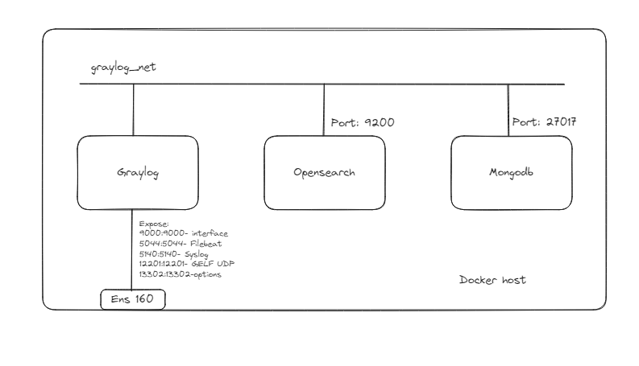
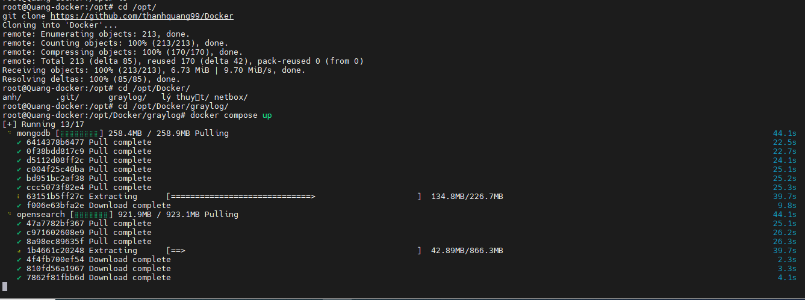
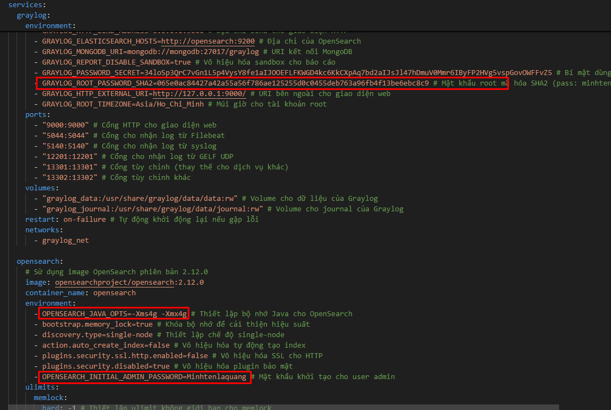
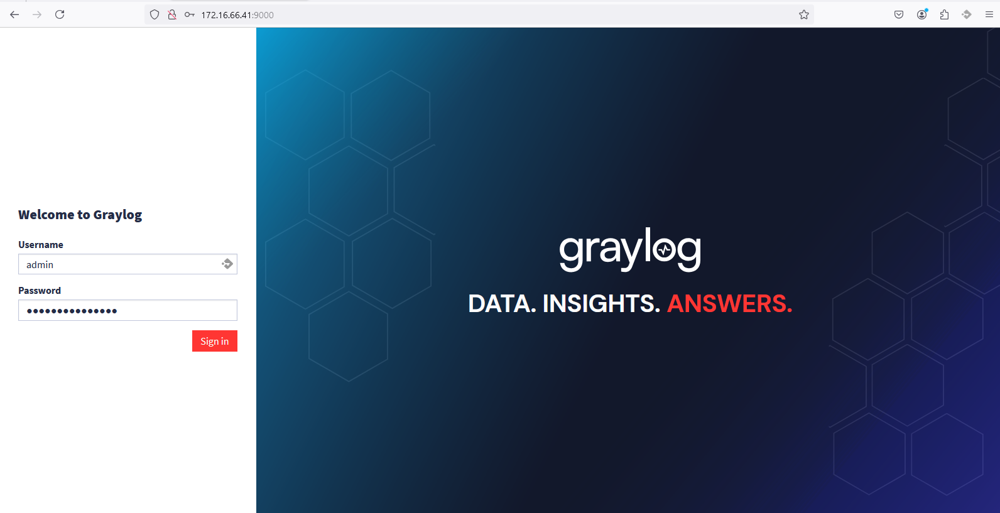
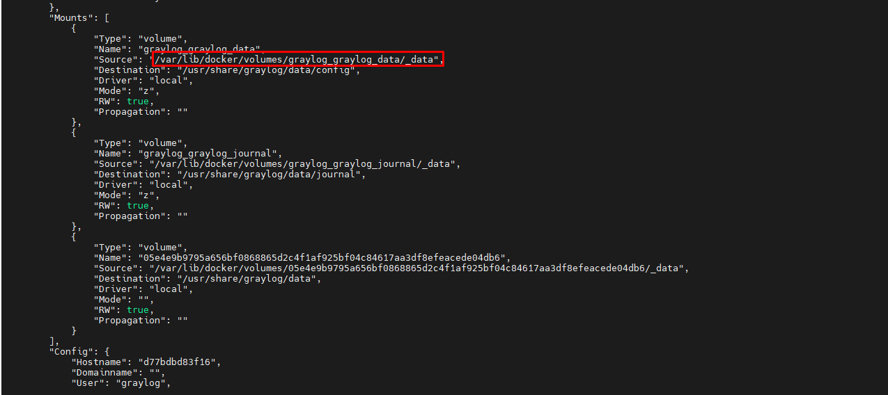
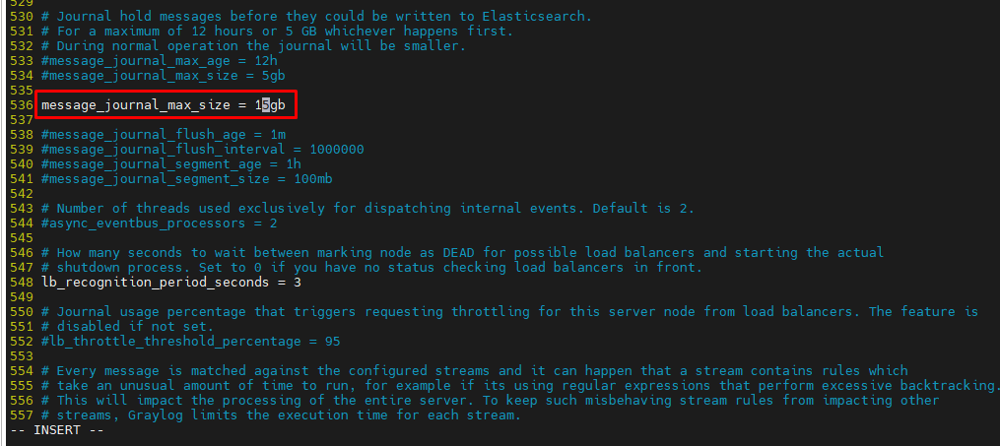
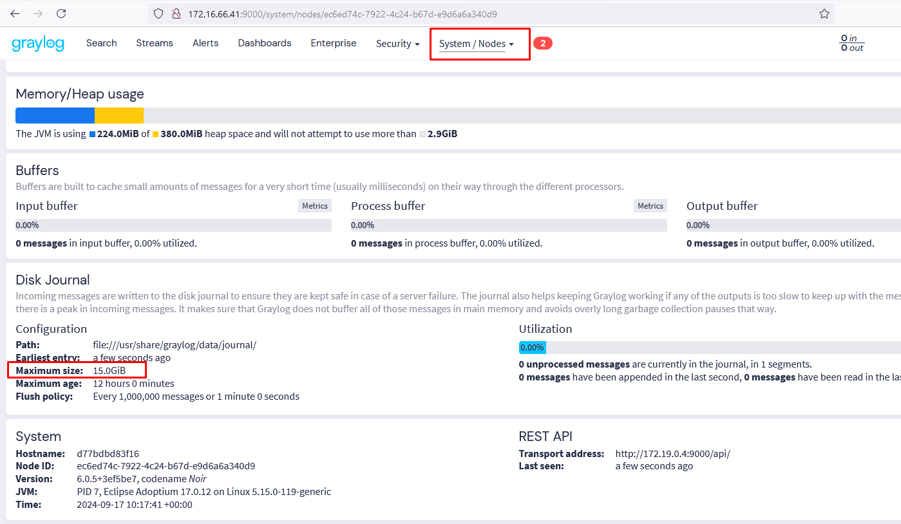

# Hướng dẫn triển khai docker graylog

Tài liệu để build graylog được tôi sử dụng và tham khảo [ở đây](https://go2docs.graylog.org/current/downloading_and_installing_graylog/docker_installation.htm?TocPath=Installing+Graylog%7C_____2). Điều tôi làm chỉ là tận dụng cấu hình của họ và sửa lại để cho phù hợp với mục đích của mình

Lưu ý cấu hình mình đang sử dụng là 8 Cpus và 12 Gb Ram
## 1. Mô hình sử dụng


Ở mô hình này tôi sử dụng 3 container graylog, opensearch, môngdb chúng liên lạc với nhau qua network : graylog_net

Riêng container graylog sử dụng expose port 9000:9000 để dùng truy cập trang web qua IP của host và các port khác dùng để nhận log các dịch vụ khác
- "5044:5044" # Cổng cho nhận log từ Filebeat
- "5140:5140" # Cổng cho nhận log từ syslog
- "12201:12201" # Cổng cho nhận log từ GELF UDP
- "13301:13301" # Cổng tùy chỉnh (thay thế cho dịch vụ khác)
- "13302:13302" # Cổng tùy chỉnh khác
## 2. Cài đặt docker graylog
- Đầu tiên sẽ tải xuống repo docker github của mình
  ```
  cd /opt/
  git clone https://github.com/thanhquang99/Docker
  ```
- Tiếp theo ta cần chạy file docker compose
  ```
  cd /opt/Docker/graylog/
  docker compose up
  ```
  
  - Ta có thể tùy chỉnh biến trong file docker compose để thay đổi user và password của graylog hay opensreach. Nếu không thay đổi thì password mặc định của graylog: `minhtenlaquang` 
  - Bạn cũng cần sử lại cấu hình graylog và opensearch sử dụng ram và cpu để phù hợp với máy của bạn. Thông thường opensearch sẽ chiếm 50% RAM và graylog chiếm 25% RAM
  

- Đợi 1 thời gian cho đến khi docker compose chạy xong ta sẽ vào trang `http://<ip-docker-host>:9000. Với user: admin, password: minhtenlaquang
  
  
## 3. Tùy chỉnh tài nguyên sử dụng mà graylog sử dụng 
Các biến graylog mà bạn cần lưu ý để có thể chỉnh sửa cho phù hợp với tài nguyên graylog của mình:
  -processbuffer_processors: Số lượng bộ xử lý cho buffer xử lý.

- outputbuffer_processors: Số lượng bộ xử lý cho buffer đầu ra (Elasticsearch).

- processor_wait_strategy: Chiến lược chờ của bộ xử lý khi không có công việc để làm (yielding, sleeping, blocking, busy_spinning).

- ring_size: Kích thước của ring buffer.

- message_journal_enabled: Kích hoạt hoặc vô hiệu hóa message journal.

- message_journal_max_size: Kích thước tối đa của message journal.

- inputbuffer_processors: Số lượng bộ xử lý cho input buffer.

- inputbuffer_ring_size: Kích thước của ring buffer cho input buffer.

- retention_strategy: Chiến lược giữ lại dữ liệu (ví dụ: delete, archive).

- rotation_strategy: Chiến lược xoay vòng chỉ mục (ví dụ: count, time).

- retention_max_index_count: Số lượng chỉ mục tối đa được giữ lại.

- rotation_max_index_size: Kích thước tối đa của chỉ mục trước khi xoay vòng.

- rotation_max_index_age: Tuổi thọ tối đa của chỉ mục trước khi xoay vòng.

- tcp_recv_buffer_size: Kích thước bộ đệm nhận TCP.

- tcp_send_buffer_size: Kích thước bộ đệm gửi TCP.

- discarders: Cấu hình số lượng và loại discarder để xử lý tin nhắn vượt quá giới hạn.

- threadpool_size: Số lượng luồng trong pool của Graylog.

Tôi sẽ hướng dẫn bạn tùy chỉnh biến message_journal_max_size để test thử.

- Ta cần xem lại thông tin các volume của graylog
  ```
  docker inspect graylog
  ```
  
- Ta sẽ sửa file
  ```
  vi /var/lib/docker/volumes/graylog_graylog_data/_data/graylog.conf
  ```
  
  ```
  docker restart graylog
  ```

Kiểm tra kết quả:

