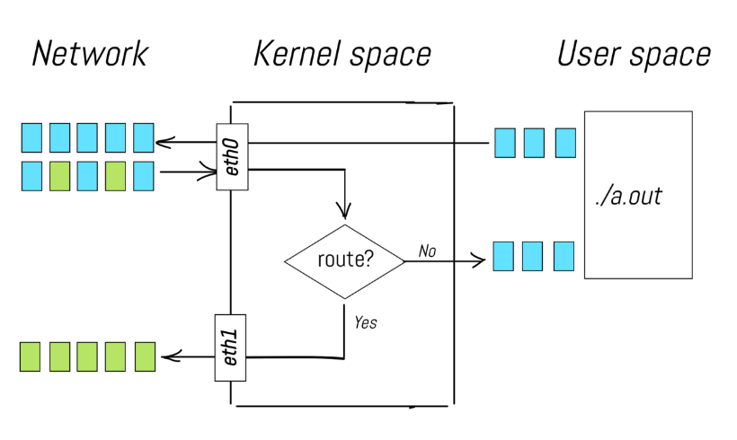
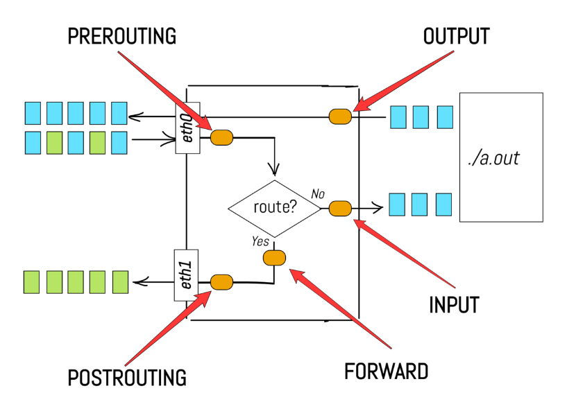
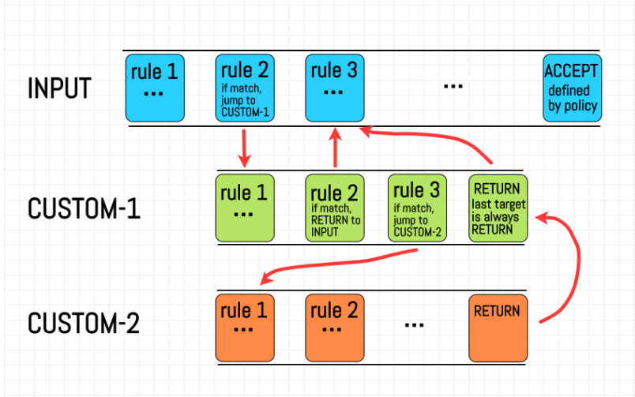
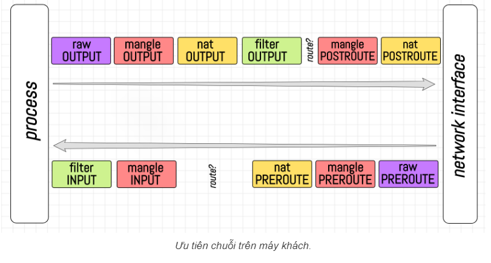

- [Tìm hiểu về iptable](#tìm-hiểu-về-iptable)
  - [1. Linux network stack](#1-linux-network-stack)
  - [2. Giới thiệu về chuỗi (Chains) của iptables](#2-giới-thiệu-về-chuỗi-chains-của-iptables)
  - [3. Quy tắc, mục tiêu và chính sách của iptables](#3-quy-tắc-mục-tiêu-và-chính-sách-của-iptables)
  - [4. Giới thiệu về các bảng (Tables) của iptables](#4-giới-thiệu-về-các-bảng-tables-của-iptables)
  - [5. Thứ tự ưu tiên các chuỗi](#5-thứ-tự-ưu-tiên-các-chuỗi)
- [Tài liệu tham khảo](#tài-liệu-tham-khảo)
# Tìm hiểu về iptable
Có lẽ bạn đã biết rằng iptables liên quan đến các gói tin IP, thậm chí là lọc các gói tin, hoặc sửa đổi gói tin! Và có lẽ bạn đã nghe rằng mọi thứ đều xảy ra trên phía kernel, không có mã người dùng tham gia. Để làm điều này, iptables cung cấp một cú pháp đặc biệt để mã hóa các quy tắc ảnh hưởng đến gói tin...
## 1. Linux network stack
Để hiểu rõ về linux network ta hãy tìm hiểu 3 ví dụ sau đây
- Một gói tin đến giao diện mạng, đi qua ngăn xếp mạng và đến một quy trình người dùng.
- Một gói tin được tạo bởi một quy trình người dùng, gửi đến ngăn xếp mạng và sau đó được giao đến giao diện mạng.
- Một gói tin đến giao diện mạng và sau đó, theo một số quy tắc định tuyến, được chuyển tiếp đến một giao diện mạng khác.



- Phần định tuyến ở giữa được cung cấp bỏi kernel của Linux, hay được gọi là forwarding bằng các gửi các giá trị khác 0 đến `/proc/sys/net/ipv4/ip_forward`
- 1 Network stack đúng phải có các giai đoạn khác nhau của quá trình xử lý gói tin 



- PREROUTING: Đây là chuỗi đầu tiên mà các gói tin đến giao diện mạng (eth0, eth1) sẽ đi qua trước khi được định tuyến. Ở giai đoạn này, các gói tin có thể được thay đổi địa chỉ đích (DNAT).

- INPUT: Sau khi đi qua chuỗi PREROUTING, nếu gói tin có địa chỉ đích là chính thiết bị này (không cần định tuyến thêm), nó sẽ đi vào chuỗi INPUT. Tại đây, gói tin được kiểm tra và xử lý trước khi được gửi đến ứng dụng người dùng (./a.out).

- FORWARD: Nếu gói tin không có địa chỉ đích là thiết bị này và cần được định tuyến tiếp tục (route? Yes), nó sẽ đi qua chuỗi FORWARD. Tại chuỗi này, các gói tin được kiểm tra và có thể được chặn hoặc cho phép chuyển tiếp qua một giao diện mạng khác.

- OUTPUT: Đây là chuỗi xử lý các gói tin được tạo ra từ chính thiết bị này (./a.out). Trước khi các gói tin này được gửi ra ngoài mạng, chúng sẽ đi qua chuỗi OUTPUT để được kiểm tra và xử lý.

- POSTROUTING: Cuối cùng, các gói tin sau khi được định tuyến hoặc chuyển tiếp sẽ đi qua chuỗi POSTROUTING trước khi rời khỏi giao diện mạng (eth0, eth1). Tại đây, các gói tin có thể được thay đổi địa chỉ nguồn (SNAT).

## 2. Giới thiệu về chuỗi (Chains) của iptables
Các giai đoạn trong ngăn xếp mạng tương ứng với các chuỗi trong iptables. Chuỗi (chain) là một tập hợp các quy tắc được sắp xếp theo thứ tự, mỗi quy tắc có thể kiểm tra gói tin và thực hiện một hành động cụ thể.

```
# Thêm quy tắc "LOG every packet" vào chuỗi INPUT
$ iptables --append INPUT --jump LOG

# Thêm quy tắc "DROP every packet" vào chuỗi INPUT
$ iptables --append INPUT --jump DROP
```

## 3. Quy tắc, mục tiêu và chính sách của iptables
Một quy tắc xác định tiêu chí cho một gói tin và mục tiêu (target) là hành động sẽ được thực hiện nếu gói tin khớp với quy tắc đó. Ví dụ:
```
# Chặn gói tin từ IP nguồn 46.36.222.157
$ iptables -A INPUT -s 46.36.222.157 -j DROP

# Chặn kết nối SSH ra ngoài
$ iptables -A OUTPUT -p tcp --dport 22 -j DROP

# Cho phép tất cả kết nối HTTP(S) đến
$ iptables -A INPUT -p tcp -m multiport --dports 80,443 -m conntrack --ctstate NEW,ESTABLISHED -j ACCEPT
$ iptables -A OUTPUT -p tcp -m multiport --dports 80,443 -m conntrack --ctstate ESTABLISHED -j ACCEPT
```


## 4. Giới thiệu về các bảng (Tables) của iptables
Các bảng trong iptables là các nhóm logic của các chuỗi. Một số bảng nổi bật bao gồm:

- filter: Bảng mặc định, chứa các chuỗi INPUT, FORWARD và OUTPUT để quản lý lọc gói tin.
- nat: Bảng này được sử dụng khi một gói tin tạo kết nối mới, chứa các chuỗi PREROUTING, OUTPUT và POSTROUTING để thay đổi địa chỉ nguồn và đích của gói tin.
- mangle: Bảng này dùng để thay đổi gói tin, chứa các chuỗi PREROUTING, INPUT, FORWARD, OUTPUT và POSTROUTING.
- raw: Bảng này dùng để cấu hình các ngoại lệ từ theo dõi kết nối, chứa các chuỗi PREROUTING và OUTPUT.
- security: Bảng này dùng cho các quy tắc kiểm soát truy cập bắt buộc (MAC), chứa các chuỗi INPUT, OUTPUT và FORWARD.

## 5. Thứ tự ưu tiên các chuỗi
- Thứ tự ưu tiên các chuỗi khi các gói tin được xử lý từ process <-> interface



- Thứ tự ưu tiên các chuỗi khi các gói tin được xử lý từ interface 1 <-> interface 2 trên máy

# Tài liệu tham khảo
https://iximiuz.com/en/posts/laymans-iptables-101/

https://github.com/hocchudong/thuctap012017/tree/master/XuanSon/Security/Iptables