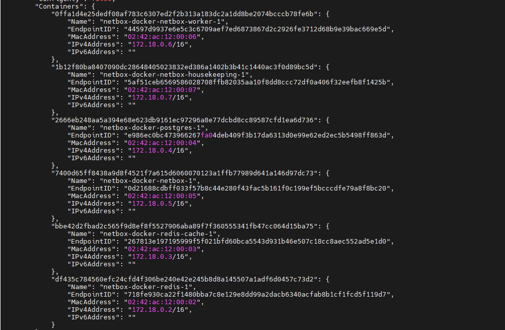
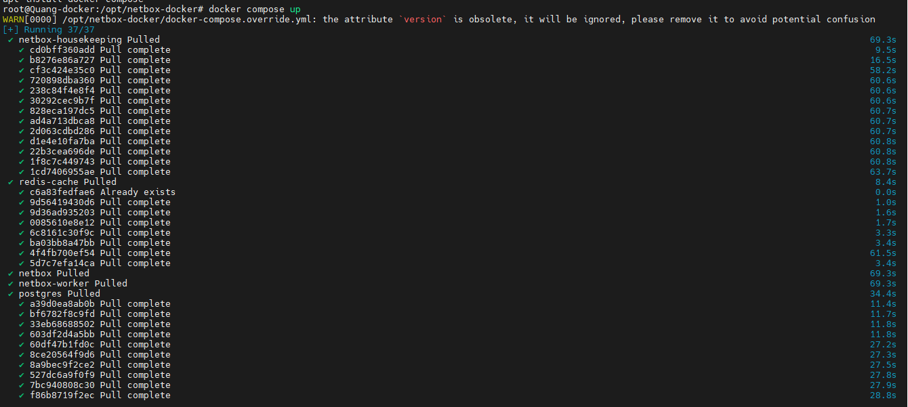
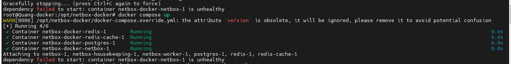
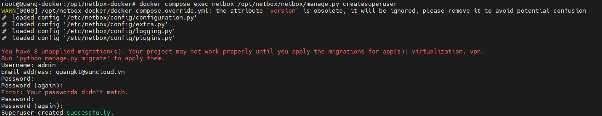
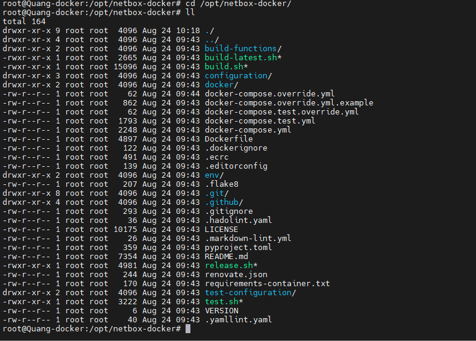

# Hướng dẫn cài đặt docker netbox chi tiết 
## 1. Yêu cầu chi tiết
Để tiếp cận và cài đặt được Netbox bằng docker thì cần phải có 
- Docker CE (Trong đây đã bao gồm đầy đủ các thành phần cơ bản của docker như docker compose, ...) 
- Để cài đặt Netbox sẽ cần đủ 4 image 
  - `docker.io/netboxcommunity/netbox:${VERSION-v4.0-2.9.1}` : Dùng cho 3 service netbox, netbox-worker, netbox-housekeeping
  - `docker.io/postgres:16-alpine`: Dùng cho service postgres (sql)
  - `docker.io/redis:7-alpine`: Dùng cho 2 service redis và redis-cache
- Tương tự ta cũng cần 6 volume để lưu trữ thông tin cho đầy đủ các container này
  - `netbox-docker_netbox-media-files`: quản lý, như hình ảnh, tài liệu, hoặc bất kỳ tệp đính kèm nào khác được người dùng tải lên trong giao diện NetBox.
  - `netbox-docker_netbox-postgres-data` : Lưu trữ dữ liệu cơ sở dữ liệu PostgreSQL của NetBox
  - `netbox-docker_netbox-redis-cache-data`: Lưu trữ dữ liệu cache của Redis (được dùng như cache cho NetBox)
  - `netbox-docker_netbox-redis-data` :Lưu trữ dữ liệu Redis liên quan đến hàng đợi công việc (queues) và các thông tin khác.
  - `netbox-docker_netbox-reports-files`: Lưu trữ các báo cáo hoặc scripts do người dùng tạo ra trong NetBox
  - `netbox-docker_netbox-scripts-files`: Lưu trữ các script tùy chỉnh được sử dụng trong NetBox.
- Network: Docker tự tạo ra 1 network bridge của mình để chứa 6 container 
  
## 2. Chi tiết cài đặt
- Tất cả những file cấu hình hay các biến môi trường hay thông tin các image cần thiết sẽ được tím thấy ở đường [link](https://github.com/netbox-community/netbox-docker)
- di chuyển đến thư mục `/opt`
  ```
  cd /opt
  ```
- Tải xuống các thông tin hỗ trợ cài đặt docker netbox
  ```
  git clone https://github.com/netbox-community/netbox-docker
  ```
- Tạo file compose để cài đặt netbox
  ```
  cd /opt/netbox-docker/
  vi docker-compose.override.yml
  ```
    ```
    services:
    netbox:
        ports:
        - 8000:8080
    ```
- Chạy docker compose 
  ```
  docker compose up
  ```
  
- Khi chạy có thể gặp lỗi này nhưng ta chỉ cần chạy lại docker compose up là được (đợi 1 lúc). Lỗi này là do thời gian chờ đợi heathcheck trong file yaml thấp hơn so với thời gian thực tế
  ```
  Gracefully stopping... (press Ctrl+C again to force)
  dependency failed to start: container netbox-docker-netbox-1 is unhealthy
  ```
  
- Tiếp theo ta cần tạo superuser
  ```
  docker compose exec netbox /opt/netbox/netbox/manage.py createsuperuser
  ```
  
- Kiểm tra bằng cách sử dụng trình duyệt web `http://<ip_address:8000`
  
## 3. Giải thích cài đặt


Trên đây là hình ảnh các file có trong netbox docker. Chúng ta sẽ cần để ý đến 3 file cần thiết trước
- `docker-compose.yml`: Đây là file docker compose chính dùng để khai báo các image, service, volume, network để build các container
- `docker-compose.override.yml`: Đây là file bổ xung cho file `docker-compose.yml`, thông thường dùng để khai báo port giữa container netbox và host
- Thư mục `ENV`: Chứa các biến môi trường cho quá trình build lên container như user, password, mail, ...

Giải thích chi tiết file `docker-compose.yml`

```
# Định nghĩa các dịch vụ cần thiết cho hệ thống NetBox

services:
  # Dịch vụ chính của NetBox
  netbox: &netbox  # Anchor 'netbox' để tái sử dụng trong các dịch vụ khác
    image: docker.io/netboxcommunity/netbox:${VERSION-v4.0-2.9.1}  # Sử dụng image NetBox từ Docker Hub, với phiên bản được chỉ định từ biến môi trường VERSION
    depends_on:  # Các dịch vụ mà NetBox phụ thuộc
    - postgres  # Phụ thuộc vào dịch vụ Postgres (Cơ sở dữ liệu)
    - redis  # Phụ thuộc vào dịch vụ Redis (Caching)
    - redis-cache  # Phụ thuộc vào dịch vụ Redis Cache
    env_file: env/netbox.env  # Tệp môi trường chứa các biến cấu hình cho NetBox
    user: 'unit:root'  # Chạy container với user 'unit' và group 'root'
    healthcheck:  # Kiểm tra sức khỏe của dịch vụ NetBox
      start_period: 60s  # Thời gian chờ trước khi bắt đầu kiểm tra sức khỏe
      timeout: 3s  # Thời gian tối đa cho mỗi lần kiểm tra
      interval: 15s  # Khoảng thời gian giữa các lần kiểm tra
      test: "curl -f http://localhost:8080/login/ || exit 1"  # Kiểm tra bằng cách gửi yêu cầu HTTP tới endpoint /login/
    volumes:  # Gắn kết các thư mục và volume vào container
    - ./configuration:/etc/netbox/config:z,ro  # mount blind Thư mục cấu hình chỉ đọc từ máy chủ host
    - netbox-media-files:/opt/netbox/netbox/media:rw  # Volume lưu trữ các tệp media
    - netbox-reports-files:/opt/netbox/netbox/reports:rw  # Volume lưu trữ các báo cáo
    - netbox-scripts-files:/opt/netbox/netbox/scripts:rw  # Volume lưu trữ các scripts

  # Dịch vụ NetBox worker
  netbox-worker:
    <<: *netbox  # Kế thừa toàn bộ cấu hình từ anchor 'netbox'
    depends_on:
      netbox:
        condition: service_healthy  # Chỉ khởi động khi dịch vụ NetBox khỏe mạnh
    command:
    - /opt/netbox/venv/bin/python  # Chạy lệnh Python trong môi trường ảo
    - /opt/netbox/netbox/manage.py  # Sử dụng manage.py của NetBox
    - rqworker  # Chạy worker để xử lý các công việc nền
    healthcheck:  # Kiểm tra sức khỏe của worker
      start_period: 20s  # Thời gian chờ trước khi bắt đầu kiểm tra sức khỏe
      timeout: 3s  # Thời gian tối đa cho mỗi lần kiểm tra
      interval: 15s  # Khoảng thời gian giữa các lần kiểm tra
      test: "ps -aux | grep -v grep | grep -q rqworker || exit 1"  # Kiểm tra tiến trình rqworker có đang chạy không

  # Dịch vụ NetBox housekeeping
  netbox-housekeeping:
    <<: *netbox  # Kế thừa toàn bộ cấu hình từ anchor 'netbox'
    depends_on:
      netbox:
        condition: service_healthy  # Chỉ khởi động khi dịch vụ NetBox khỏe mạnh
    command:
    - /opt/netbox/housekeeping.sh  # Chạy script housekeeping để bảo trì hệ thống
    healthcheck:  # Kiểm tra sức khỏe của housekeeping
      start_period: 20s  # Thời gian chờ trước khi bắt đầu kiểm tra sức khỏe
      timeout: 3s  # Thời gian tối đa cho mỗi lần kiểm tra
      interval: 15s  # Khoảng thời gian giữa các lần kiểm tra
      test: "ps -aux | grep -v grep | grep -q housekeeping || exit 1"  # Kiểm tra tiến trình housekeeping có đang chạy không

  # Dịch vụ cơ sở dữ liệu PostgreSQL
  postgres:
    image: docker.io/postgres:16-alpine  # Sử dụng image PostgreSQL từ Docker Hub
    env_file: env/postgres.env  # Tệp môi trường chứa các biến cấu hình cho PostgreSQL
    volumes:
    - netbox-postgres-data:/var/lib/postgresql/data  # Volume lưu trữ dữ liệu của PostgreSQL

  # Dịch vụ Redis cho caching
  redis:
    image: docker.io/redis:7-alpine  # Sử dụng image Redis từ Docker Hub
    command:
    - sh
    - -c  # Chạy lệnh Redis Server với cấu hình từ biến môi trường
    - redis-server --appendonly yes --requirepass $$REDIS_PASSWORD  # Kích hoạt append-only mode và yêu cầu mật khẩu
    env_file: env/redis.env  # Tệp môi trường chứa các biến cấu hình cho Redis
    volumes:
    - netbox-redis-data:/data  # Volume lưu trữ dữ liệu của Redis

  # Dịch vụ Redis cache cho NetBox
  redis-cache:
    image: docker.io/redis:7-alpine  # Sử dụng image Redis từ Docker Hub
    command:
    - sh
    - -c  # Chạy lệnh Redis Server với cấu hình từ biến môi trường
    - redis-server --requirepass $$REDIS_PASSWORD  # Yêu cầu mật khẩu khi truy cập Redis
    env_file: env/redis-cache.env  # Tệp môi trường chứa các biến cấu hình cho Redis Cache
    volumes:
    - netbox-redis-cache-data:/data  # Volume lưu trữ dữ liệu cache của Redis

# Định nghĩa các volumes cho các dịch vụ
volumes:
  netbox-media-files:
    driver: local  # Sử dụng driver local để tạo volume lưu trữ tệp media của NetBox
  netbox-postgres-data:
    driver: local  # Sử dụng driver local để tạo volume lưu trữ dữ liệu của PostgreSQL
  netbox-redis-cache-data:
    driver: local  # Sử dụng driver local để tạo volume lưu trữ dữ liệu cache của Redis
  netbox-redis-data:
    driver: local  # Sử dụng driver local để tạo volume lưu trữ dữ liệu của Redis
  netbox-reports-files:
    driver: local  # Sử dụng driver local để tạo volume lưu trữ các báo cáo của NetBox
  netbox-scripts-files:
    driver: local  # Sử dụng driver local để tạo volume lưu trữ các scripts của NetBox
```
# Tài liệu tham khảo
https://www.packetswitch.co.uk/how-to-install-netbox-on-docker/

https://github.com/netbox-community/netbox-docker
