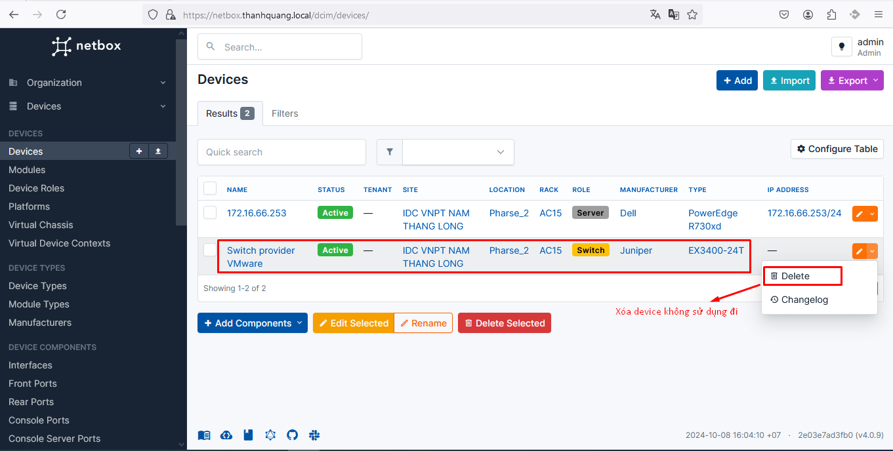
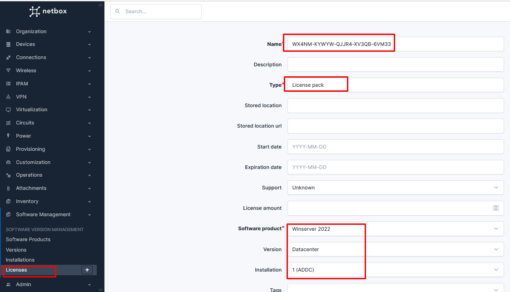

- [Hướng dẫn sử dụng docker compose để cấu hình netbox + nginx làm revser proxy](#hướng-dẫn-sử-dụng-docker-compose-để-cấu-hình-netbox--nginx-làm-revser-proxy)
  - [1. Mô hình docker compose mà tôi build](#1-mô-hình-docker-compose-mà-tôi-build)
  - [2. Hướng dẫn sử dụng](#2-hướng-dẫn-sử-dụng)
  - [3. Hướng dẫn cài đặt plugin netbox-attachments cho netbox](#3-hướng-dẫn-cài-đặt-plugin-netbox-attachments-cho-netbox)
    - [3.1 Các bước cần phải làm](#31-các-bước-cần-phải-làm)
    - [3.2 Các bước thực hành chi tiết](#32-các-bước-thực-hành-chi-tiết)
  - [4. Hướng dẫn cài đặt plugin netbox-inventory](#4-hướng-dẫn-cài-đặt-plugin-netbox-inventory)
    - [4.1 Các bước cài đặt chi tiết](#41-các-bước-cài-đặt-chi-tiết)
    - [4.2 Một số cấu hình cụ thể có thể được sử dụng với plugin](#42-một-số-cấu-hình-cụ-thể-có-thể-được-sử-dụng-với-plugin)
    - [4.3 Sử dụng thực tế](#43-sử-dụng-thực-tế)
  - [5. Hướng dẫn cài đặt plugin netbox-svm (netbox-software-version-manager)](#5-hướng-dẫn-cài-đặt-plugin-netbox-svm-netbox-software-version-manager)
    - [5.1 Các bước cài đặt chi tiết](#51-các-bước-cài-đặt-chi-tiết)
    - [5.2 Sử dụng thực tế](#52-sử-dụng-thực-tế)
  - [6. Xử lý nếu chưa có volume netbox-python-site-packages](#6-xử-lý-nếu-chưa-có-volume-netbox-python-site-packages)
    - [6.1 Chi tiết các bước thực hiện](#61-chi-tiết-các-bước-thực-hiện)
  - [7. Cài đặt plugin netbox-svm version mới](#7-cài-đặt-plugin-netbox-svm-version-mới)
# Hướng dẫn sử dụng docker compose để cấu hình netbox + nginx làm revser proxy
Tài liệu để build netbox riêng lẻ được tôi sử dụng và tham khảo [ở đây](https://github.com/netbox-community/netbox-docker). Điều tôi làm chỉ là tận dụng cấu hình của họ và sửa lại để cho phù hợp với mục đích của mình

Phiên bản docker mình sử dụng là Docker ce version 27.2.1
## 1. Mô hình docker compose mà tôi build


Giải thích:
- 4 container này được sử dụng chung 1 docker network (netbox_net)
- Chỉ có duy nhất container my_nginx được ánh xạ 2 port 80 <-> 80, 443 <-> 443

## 2. Hướng dẫn sử dụng 
- Đầu tiên bạn sẽ cần download repo này về. Lưu ý bắt buộc phải di chuyển đến thư mục /opt nếu không file active sẽ có thể bị lỗi
  ```
  cd /opt/
  git clone https://github.com/thanhquang99/Docker
  ```
- Tiếp theo ta sẽ chạy file docker compose
  ```
  cd /opt/Docker/netbox/
  docker compose up
  ```
  
  - Ta có thể tùy chỉnh biến trong file docker compose để thay đổi user và password của netbox hay postgres
  ```
  vi /opt/Docker/netbox/docker-compose.yml
  ```
  
- Đợi thời gian khoảng 5 phút để docker compose chạy xong ta sẽ tạo thêm 1 terminal mới `ctrl +shirt +u` để tiến hành active bao gòm tạo super user và cấu hình nginx làm reverse proxy
  ```
  cd /opt/Docker/netbox/
  chmod +x active.sh
  . active.sh
  ```
- Bây giờ ta cần nhập thông tin từ màn hình vào (yêu cầu đúng cú pháp được gợi ý), thông tin sẽ bao gồm tên miền của netbox, gmail, user và password của netbox
  
  - Nếu bạn quên thông tin mà bạn đã nhập bạn có thể xem file thông tin
    ```
    root@Quang-docker:~# cat thongtin.txt
    Sửa file hosts thành 172.16.66.41 quang.netbox.com
    Link truy cập netbox: https://quang.netbox.com
    Netbox User: admin
    Netbox password: fdjhuixtyy5dpasfn
    netbox mail: quang@gmail.com
    Sửa file hosts thành 172.16.66.41 quang.netbox.com
    Link truy cập netbox: https://quang.netbox.com
    Netbox User: fdjhuixtyy5dpasfn
    Netbox password: fdjhuixtyy5dpasfn
    netbox mail: quang@gmail.com
    ```
## 3. Hướng dẫn cài đặt plugin netbox-attachments cho netbox
Link tài liệu được lấy [ở đây](https://github.com/ArnesSI/netbox-inventory/)

netbox-attachments là một plugin hoặc tính năng trong NetBox, một công cụ quản lý tài sản mạng và tài nguyên hạ tầng. Plugin này cho phép người dùng thêm và quản lý các tệp đính kèm cho các đối tượng trong NetBox
### 3.1 Các bước cần phải làm
- Bước 1: Tải xuống plugin bằng lệnh pip
- Bước 2: Sửa file `configuration.py` để có thể cấu hình plugin
- Bước 3: Chuyển cơ sở dữ liệu cho plugin
### 3.2 Các bước thực hành chi tiết
Bước 1: Truy cập vào container để chạy lệnh tải xuống plugin
```
docker exec -it my_netbox bash
pip install netbox-attachments==5.1.3
```
Bước 2: Tạo 1 session mới trên mobaxterm (không truy cập vào container netbox) để sử file `configuration.py`
```
vi /var/lib/docker/volumes/netbox_netbox-conf/_data/configuration.py
```
Thêm vào cuối file dòng sau:
```
PLUGINS = ['netbox_attachments']
PLUGINS_CONFIG = {
    'netbox_attachments': {
        'apps': ['dcim', 'ipam', 'circuits', 'tenancy', 'virtualization', 'wireless', 'inventory_monitor'],
        'display_default': "right_page",
        'display_setting': {
            'ipam.vlan': "left_page",
            'dcim.device': "full_width_page",
            'dcim.devicerole': "full_width_page",
            'inventory_monitor.probe': "additional_tab"
        }
    }
}
```


Bước 3: Ở terminal có truy cập netbox thực hiện lệnh
```
mkdir -p /opt/netbox/netbox/media/netbox-attachments
cd /opt/netbox/netbox/media/
chown unit:root netbox-attachments
```
Bước 4: Di chuyển cơ sở dữ liệu cho plugin
```
cd /opt/netbox/netbox/
python3 manage.py migrate netbox_attachments
```
Bây giờ ta có thể lên interface netbox để kiểm tra kết quả


Ta có thể upload ảnh vào virtual machine để kiểm tra kết quả


[Một số tùy chỉnh ta có thể tùy chỉnh thêm cho netbox-attachments](https://github.com/Kani999/netbox-attachments?tab=readme-ov-file#plugin-options)


## 4. Hướng dẫn cài đặt plugin netbox-inventory
Tài liệu tham khảo được lấy [ở đây](https://github.com/ArnesSI/netbox-inventory)


Plugin này được sử dụng để:
- Quản lý tài sản phần cứng (Assets): 
  - Plugin cho phép quản lý các tài sản vật lý như thiết bị mạng, module, và các mục lưu kho khác.
  - Bạn có thể theo dõi tình trạng của tài sản, như đang sử dụng hay đang lưu trữ, giúp tối ưu hóa việc quản lý và triển khai thiết bị.
- Quản lý loại và nhóm mục lưu trữ:
  - Inventory Item Types: Định nghĩa các loại mục lưu trữ tương đương với các loại thiết bị và module. Điều này giúp chuẩn hóa các tài sản trong hệ thống.
  - Inventory Item Groups: Nhóm các mục lưu trữ thành các nhóm cụ thể để dễ quản lý, tìm kiếm và theo dõi số lượng tài sản dự trữ.
- Quản lý nhà cung cấp và giao nhận:
  - Suppliers: Lưu trữ và quản lý thông tin về các nhà cung cấp phần cứng.
  - Purchases: Quản lý các lần mua thiết bị, bao gồm số lượng, ngày mua, và nhà cung cấp liên quan.
  - Deliveries: Theo dõi và quản lý các giao nhận hàng hoá, giúp bạn nắm rõ lịch sử vận chuyển và thời gian nhận hàng.
### 4.1 Các bước cài đặt chi tiết
Bước 1: Ta vào terminal truy cập vào container netbox
```
docker exec -it my_netbox bash
source /opt/netbox/venv/bin/activate
pip install netbox-inventory==2.0.2
```
Bước 2: Tạo 1 terminal khác sửa volume chứa  của netbox
```
vi /var/lib/docker/volumes/netbox_netbox-conf/_data/configuration.py
```
- Nếu muốn sử dụng nhiều plugin thì sẽ khai báo như sau:
```
PLUGINS = [
    'netbox_attachments',
    'netbox_inventory'
]

PLUGINS_CONFIG = {
    'netbox_attachments': {
        'apps': ['dcim', 'ipam', 'circuits', 'tenancy', 'virtualization', 'wireless', 'inventory_monitor'],
        'display_default': "right_page",
        'display_setting': {
            'ipam.vlan': "left_page",
            'dcim.device': "full_width_page",
            'dcim.devicerole': "full_width_page",
            'inventory_monitor.probe': "additional_tab"
        }
    },
    'netbox_inventory': {
        "used_status_name": "used",
        "stored_status_name": "stored",
        "sync_hardware_serial_asset_tag": True,
    }
}
```

- Nếu chỉ dùng 1 plugin
```
PLUGINS = [
    'netbox_inventory'
]

PLUGINS_CONFIG = {
    "netbox_inventory": {
        # Example settings below, see "Available settings"
        # in README.md for all possible settings
        "used_status_name": "used",
        "stored_status_name": "stored",
        "sync_hardware_serial_asset_tag": True,
    },
}
```

Bước 3: Tiếp hành di chuyển cơ sở dữ liệu cho plugin (ở terminal truy cập container netbox)

```
cd /opt/netbox/netbox/
python3 manage.py migrate
python3 manage.py reindex --lazy
```

Kiểm tra kết quả


Nếu bạn chưa thấy kết quả này có thể restart lại container
```
docker restart my_netbox
```

### 4.2 Một số cấu hình cụ thể có thể được sử dụng với plugin
|Thông số|Giá trị mặc định|Miêu tả|
|--------|-------|-------|
|top_level_menu|True|Plugin này sẽ được hiện ở đầu menu|
|used_status_name|used|Trạng thái cho biết tài sản đang được sử dụng|
|stored_status_name|stored|Trạng thái cho biết tài sản đang được lưu trữ|
|sync_hardware_serial_asset_tag|False|Khi một tài sản được gán hoặc hủy gán cho một thiết bị, mô-đun hoặc mục hàng tồn kho cần cập nhật lại seri để id để đông bộ hóa tài sản|
|asset_import_create_purchase|False|Khi nhập tài sản, tự động tạo bất kỳ giao dịch mua, giao hàng hoặc nhà cung cấp nào nếu chưa tồn tại|
|asset_import_create_device_type|False|Khi nhập tài sản loại thiết bị, tự động tạo nhà sản xuất và/hoặc loại thiết bị nếu nó không tồn tại|
|asset_import_create_module_type|False|Khi nhập tài sản loại hàng tồn kho, tự động tạo nhà sản xuất và/hoặc loại thiết bị nếu nó không tồn tại|
|asset_import_create_tenant|False|Khi nhập một tài sản, với chủ sở hữu hoặc người thuê, tự động tạo người thuê nếu nó không tồn tại|
|asset_disable_editing_fields_for_tags|{}|Vô hiệu hóa chỉnh sửa 1 số trường chỉ định|
|asset_disable_deletion_for_tags|[]|Danh sách các thẻ sẽ vô hiệu hóa việc xóa tài sản|
|asset_custom_fields_search_filters|{}| các trường tùy chỉnh và loại tra cứu sẽ được thêm vào bộ lọc tìm kiếm cho tài sản|
|asset_warranty_expire_warning_days|90|Số ngày kể từ ngày hết hạn bảo hành sẽ hiển thị dưới dạng cảnh báo trong trường Thời hạn bảo hành còn lại|
|prefill_asset_name_create_inventoryitem|False|Khi mục kiểm kê phần cứng được tạo từ một tài sản, hãy điền trước tên InventoryItem sao cho khớp với tên tài sản.|
|prefill_asset_tag_create_inventoryitem|False|Khi mục kiểm kê phần cứng được tạo từ một tài sản, hãy điền trước các thẻ để khớp với các thẻ được liên kết với tài sản đó.|

### 4.3 Sử dụng thực tế 
- Sử dụng kho để tạo device mới
  


- Chuyển device về kho: Ta cần xóa liên kết đến device rồi sau đó xóa device đó đi




## 5. Hướng dẫn cài đặt plugin netbox-svm (netbox-software-version-manager)
Plugin này được lấy và tham khảo [ở đấy](https://github.com/hocchudong/netbox-software-version-manager)


Những thứ mà plugin này có thể làm được:
- Software Products: Quản lý tên phần mềm và nhà phát triển
- Versions: Quản lý các version mà phần mềm tạo bên trên có sẵn
- Installations: Quản lý các thông tin device hay máy ảo nào được cài đặt phần mềm đó
- Licenses: Quản lý các license chưa sử dụng hay đã được sử dụng cho máy nào và thời gian sử dụng còn bao lâu

### 5.1 Các bước cài đặt chi tiết
Bước 1: Dùng terminal để truy cập vào container netbox và tải xuống plugin
```
docker exec -it my_netbox bash
source venv/bin/activate
pip install netbox-svm
```
Bước 2: Truy cập vào terminal không chứa container netbox và sửa volume chứa file cấu hình
```
vi /var/lib/docker/volumes/netbox_netbox-conf/_data/configuration.py
```
```
PLUGINS = [
    'netbox_attachments',
    'netbox_inventory',
    'netbox_svm'
]

PLUGINS_CONFIG = {
    'netbox_attachments': {
        'apps': ['dcim', 'ipam', 'circuits', 'tenancy', 'virtualization', 'wireless', 'inventory_monitor'],
        'display_default': "right_page",
        'display_setting': {
            'ipam.vlan': "left_page",
            'dcim.device': "full_width_page",
            'dcim.devicerole': "full_width_page",
            'inventory_monitor.probe': "additional_tab"
        }
    },
    'netbox_inventory': {
        "used_status_name": "used",
        "stored_status_name": "stored",
        "sync_hardware_serial_asset_tag": True,
    }
}
```
Bước 3: Vòa terminal truy cập container netbox để tiến hành chuyển cơ sở dữ liệu
```
cd /opt/netbox/netbox/
python manage.py migrate netbox_svm
```

Kiểm tra kết quả


### 5.2 Sử dụng thực tế
- Tạo Software Products
  


- Tạo version cho software này


- Cài đặt software này cho máy ảo


- Tạo license để kích hoạt phần mềm bản quyền (nếu cần):



## 6. Xử lý nếu chưa có volume netbox-python-site-packages
Đôi khi các bạn sử dụng docker compose tạo netbox mà chưa có volume netbox-python-site-packages thì ta cần xử lý thế nào

Các bước cần thực hiện:
- Tạo volume mới để copy file vào (Lưu ý tên volume phải đặt đúng mẫu vì tên volume sẽ khác so với tên file docker-compose.yml)
- Tiếp theo copy file plugin từ container netbox vào volume
- Sửa lại docker-compose.yml để khai báo thêm volume mới
- Bật lại docker compose

### 6.1 Chi tiết các bước thực hiện
- Tìm kiếm mẫu volume của netbox
  ```
  docker inspect my_netbox
  ```
  

  vậy là sẽ có thêm tiền tố `netbox_` vào tên volume
- Tạo volume mới
  ```
  docker volume create netbox_netbox-python-site-packages
  ```
- Copy các file plugin vào
  ```
  docker cp my_netbox:/opt/netbox/venv/lib/python3.11/site-packages /var/lib/docker/volumes/netbox_netbox-python-site-packages/_data/
  mv /var/lib/docker/volumes/netbox_netbox-python-site-packages/_data/site-packages/* /var/lib/docker/volumes/netbox_netbox-python-site-packages/_data/
  rm -rf /var/lib/docker/volumes/netbox_netbox-python-site-packages/_data/site-packages
  ```
- Sửa lại file docker compose
  ```
  cd /opt/Docker/netbox
  vi docker-compose.yml
  ```
  - Thêm vào nội dung sau ở mục volume:
  ```
  - netbox-python-site-packages:/opt/netbox/venv/lib/python3.11/site-packages:rw
  ```
  - Thêm vào loại volume
  ```
  netbox-python-site-packages:
    driver: local
  ```
- Bây giờ ta có thể test bằng lệnh
  ```
  docker compose down
  docker compose up
  ```
  

## 7. Cài đặt plugin netbox-svm version mới
Bản trước tôi cài là bản netbox-svm 1.0.1 nhưng bây giờ đã có bản 1.1.0, tôi muốn cài lại bản mới nhất
- Xóa bản cũ đi
  ```
  pip uninstall netbox-svm
  ```
- Cài lại bản mới
  ```
  pip install netbox-svm==1.1.0
  ```
- Update lại cơ sở dữ liệu
  ```
  cd /opt/netbox/netbox/
  python manage.py migrate netbox_svm
  ```
